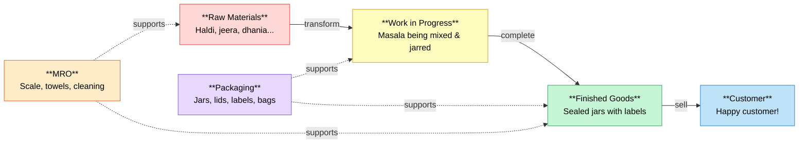
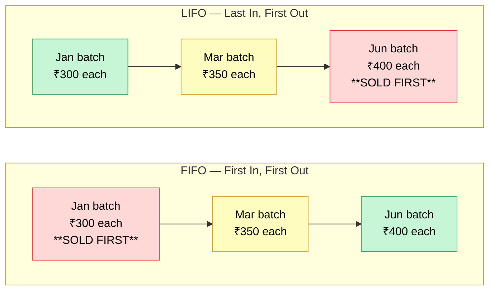
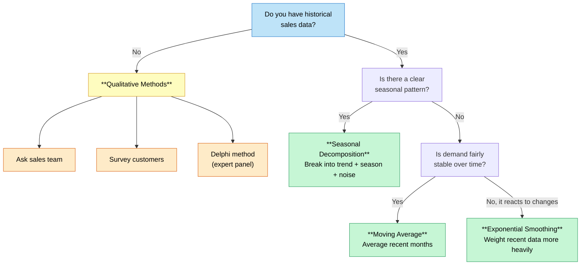
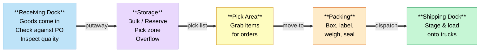

# Inventory Management & Asset Tracking: A Complete Guide

> From stockroom basics to enterprise-scale systems — with real-world examples and a running case study throughout.

---

# MEET NADIA: OUR RUNNING CASE STUDY

Throughout this guide, we'll follow **Nadia**, a fictional entrepreneur, as she builds a spice business from scratch. Her journey mirrors what thousands of real business owners experience, and we'll use her story to make every concept concrete.

**The beginning:**
Nadia loves cooking and starts blending her own spice mixes at home — a Biryani Masala, a Garam Masala, a Chai Masala, and a Tandoori Rub. Friends rave about them. She starts selling at a local weekend market (haat) and to friends.

**Her starting inventory setup:**
- 15 spice blends (15 SKUs) — things like Biryani Masala, Pav Bhaji Masala, Chole Masala, Chai Masala, and more
- Stored in a spare room at home on a single shelf
- Tracked in a notebook: product name, how many jars she has, what she sold today
- She buys raw spices (jeera, haldi, dhania, lal mirch, etc.) from Crawford Market in Pune
- She fills and labels jars by hand

This is where most businesses start — small, simple, manual. As Nadia grows, we'll revisit her at the end of each chapter to see how she applies what we've learned.

---

# PART I: FOUNDATIONS

---

## Chapter 1: What Is Inventory?

In the simplest terms: **inventory is the stuff a business keeps on hand to sell or use.** That's it. Whether it's jars of spice on a shelf, steel in a factory, or laptops in a stockroom — if a business is holding it for a purpose, it's inventory.

### 1.1 Why Inventory Exists

Think about ordering food at a restaurant. You don't want to wait 2 hours for the kitchen to go buy ingredients from a farm. The restaurant keeps ingredients on hand so they can serve you quickly.

Every business faces this same tension:

- **Customers want things now.** Nobody likes waiting.
- **Making or getting things takes time.** Raw materials need to be bought, products need to be made, shipments need to travel.

Inventory bridges that gap. It's a buffer between "when things are ready" and "when customers want them."

**Real-life example:**
Your local grocery store doesn't call the dairy farm when you want milk. They predicted you'd want it, stocked it on the shelf yesterday, and it's waiting for you right now. That carton of milk sitting on the shelf? That's inventory.

### 1.2 Types of Inventory

There are five main types. Think of them as stages in a journey from raw material to customer.

```
  ┌──────────────┐    ┌──────────────┐    ┌──────────────┐    ┌──────────────┐
  │              │    │              │    │              │    │              │
  │    RAW       │───▶│   WORK IN    │───▶│   FINISHED   │───▶│  CUSTOMER    │
  │  MATERIALS   │    │  PROGRESS    │    │    GOODS     │    │              │
  │              │    │   (WIP)      │    │              │    │              │
  │  Haldi,      │    │  Masala being│    │  Sealed jars │    │  Happy       │
  │  jeera,      │    │  mixed &     │    │  with labels,│    │  customer!   │
  │  dhania...   │    │  jarred      │    │  ready to    │    │              │
  │              │    │              │    │  sell        │    │              │
  └──────────────┘    └──────────────┘    └──────────────┘    └──────────────┘
        ▲                                                            │
        │                    ┌──────────────┐                        │
        │                    │  PACKAGING   │                        │
        │                    │  Jars, lids, │                        │
        │                    │  labels, bags│                        │
        │                    └──────────────┘                        │
        │                                                            │
        │                    ┌──────────────┐                        │
        │                    │     MRO      │                        │
        └────────────────────│  Scale,      │────────────────────────┘
           (supports the     │  towels,     │    (supports the
            whole process)   │  cleaning    │     whole process)
                             └──────────────┘
```

> **Visual diagram** (renders on GitHub):



#### Raw Materials
The basic ingredients you start with — things you buy to turn into something else.

| If you're a... | Your raw materials are... |
|----------------|--------------------------|
| Bakery | Flour, sugar, eggs, butter |
| Car maker | Steel, rubber, glass, wiring |
| Clothing brand | Fabric, thread, buttons, zippers |
| Nadia's Spice Shop | Cumin seeds, paprika, turmeric, salt, jars, labels |

**Real-life example:**
Toyota buys steel coils from steel companies. Those coils sit in Toyota's warehouse as raw materials until they're stamped into car body panels.

#### Work-In-Progress (WIP)
Things that are being made but aren't finished yet. They're stuck in the middle — you've spent money on them, but you can't sell them.

**Think of it like a half-baked cake.** You've used the ingredients (spent money), but nobody's going to buy it until it comes out of the oven.

**Real-life example:**
At a Boeing factory, a half-built airplane fuselage is WIP. The aluminum has been cut and shaped, but it's not a plane yet. You can't fly it. You can't sell it. It just sits there costing money.

**Why WIP is dangerous:**
- Money is already spent (materials + labor) but you're earning nothing from it yet
- It takes up space
- If designs change mid-build, it can become worthless

#### Finished Goods
Done! Ready to sell. Boxed up, labeled, sitting on a shelf waiting for a customer.

**Real-life example:**
An iPhone in Apple's warehouse — boxed, sealed, ready to ship to a store. That's finished goods.

#### MRO (Maintenance, Repair, and Operations)
Stuff a business needs to keep running, but it's NOT part of what they sell. Think: light bulbs, cleaning supplies, machine oil, printer paper, safety gloves.

**Real-life example:**
A car factory uses thousands of welding tips per day. They wear out and get replaced constantly. The customer never sees them — they're not part of the car — but without them, the factory stops.

#### Packaging Materials
Boxes, labels, tape, bubble wrap — everything used to package and ship products.

**Real-life example:**
Amazon's warehouses stock dozens of different box sizes, air pillows, and tape. Running out of boxes is just as bad as running out of products — orders can't ship without packaging.

### 1.3 Inventory vs. Assets: What's the Difference?

This confuses a lot of people, but the rule is simple:

> **Inventory** = things you plan to **sell or use up quickly** (days to months)
> **Assets** = things you plan to **keep and use for a long time** (years)

Here's the interesting part — **the same physical object can be either one,** depending on who owns it and what they plan to do with it:

- A Dell laptop in Dell's warehouse → **Inventory** (Dell plans to sell it)
- That same laptop on your office desk → **Asset** (you plan to use it for years)
- That same laptop at a refurbishment shop → **Inventory** (they'll fix and resell it)

| | Inventory | Asset |
|--|-----------|-------|
| **Purpose** | Sell it or use it up | Keep it and use it |
| **How long you have it** | Days to months | Years |
| **Examples** | Products on shelves, raw materials | Machines, vehicles, computers, furniture |
| **What you track** | How many, what it costs, how fast it sells | Where it is, who has it, how much it's depreciated |

### 1.4 The Cost of Holding Inventory

```
  HOLDING COST BREAKDOWN (20-35% of inventory value per year)

  ┌─────────────────────────────────────────────────────────┐
  │                                                         │
  │  ██████████████████  Opportunity Cost (8-15%)           │
  │  ████████████████    "My ₹10 lakh is stuck in stock    │
  │                       instead of earning returns"       │
  │                                                         │
  │  ████████            Storage Cost (2-5%)                │
  │                      "Rent, electricity, shelving"      │
  │                                                         │
  │  ██████              Insurance & Protection (1-3%)      │
  │                      "Insurance, security"              │
  │                                                         │
  │  ████████████████    Risk Cost (5-15%)                  │
  │  ██████████████      "Damage, theft, expiry,           │
  │                       obsolescence"                     │
  └─────────────────────────────────────────────────────────┘
```

Here's something that surprises most beginners: **inventory is NOT free to hold.** Even after you've paid for it, it keeps costing you money every single day it sits there.

The total cost of holding inventory is typically **20-35% of its value per year.** That means if you're holding ₹10,00,000 (₹10 lakh) worth of inventory, it costs you ₹2,00,000-₹3,50,000 per year just to HAVE it.

**Where does that cost come from?**

Think of it in four buckets:

1. **Your money is locked up** (8-15%): That ₹10 lakh sitting in inventory could have been invested, earning returns, or used to grow the business. Economists call this "opportunity cost."

2. **You need space to store it** (2-5%): Warehouse rent, electricity, shelving, forklifts.

3. **You need to protect it** (1-3%): Insurance, security, property taxes on inventory.

4. **Things go wrong** (5-15%): Items get damaged, stolen, or become obsolete. Food spoils. Fashion goes out of style. Technology becomes outdated.

**Real-life example:**
In 2001, Cisco wrote off **$2.2 billion (about ₹18,000 crore)** in excess inventory when the dot-com bubble burst. They had ordered tons of networking equipment based on overly optimistic forecasts. When demand crashed, they were stuck with warehouses full of stuff nobody wanted. ₹18,000 crore — gone.

### 1.5 The Cost of NOT Having Inventory (Stockouts)

The flip side is just as painful. When you don't have what customers want:

- **Lost sales:** Customer goes to a competitor
- **Lost customers:** They don't just leave — they might never come back
- **Emergency costs:** You end up paying for expensive rush shipping to get stock
- **Reputation damage:** "They're always out of stock" becomes your brand image

**Real-life example:**
During the 2020-2021 chip shortage, car makers like Ford and Maruti Suzuki couldn't finish building vehicles because they were missing a single ₹80 computer chip. An ₹80 chip held up a ₹15,00,000 car. Ford estimated the shortage cost them **$2.5 billion (₹20,000+ crore)** in 2021 alone. Maruti Suzuki lost production of over 1.6 lakh cars.

**The big takeaway:**
Inventory management is a balancing act. Too much inventory = wasted money. Too little inventory = lost sales. The whole point of everything in this guide is to help you find the sweet spot.

```
  THE INVENTORY BALANCING ACT

  Too Much Inventory              Just Right                Too Little Inventory
  ❌ Wasted money                ✅ THE SWEET SPOT          ❌ Lost sales
  ❌ Cash locked up              ✅ Happy customers          ❌ Angry customers
  ❌ Risk of damage/expiry       ✅ Cash flowing             ❌ Rush orders (expensive)
  ❌ Storage costs piling up     ✅ Low waste                ❌ Reputation damage

       ₹₹₹ sitting idle   ◀━━━━━━ GOAL ━━━━━━▶    Shelves are empty
       in your godown              🎯                customers walk away

  The entire field of inventory management exists to find this sweet spot.
```

### Nadia's Story: Chapter 1

Nadia's inventory at this stage is simple:
- **Raw materials:** 20 spices bought in bulk bags from a wholesale shop
- **WIP:** Spice blends measured and mixed but not yet jarred
- **Finished goods:** Labeled jars ready for the local market
- **MRO:** Paper towels for cleanup, a kitchen scale battery
- **Packaging:** Jars, lids, labels, small paper bags for market sales

She keeps about ₹60,000 worth of inventory in her garage. Using our 25% rule, that's costing her about ₹15,000/year in hidden costs (mostly the risk of spices going stale, plus the space in her room she can't use for anything else).

One Saturday, she runs out of her popular Biryani Masala at the local market by 11 AM. She watches customers walk away disappointed. That's her first stockout — and the pain of lost sales motivates her to start tracking inventory more carefully.

---

## Chapter 2: Inventory Identification — Giving Everything a Name and Number

Before you can manage inventory, every item needs a clear, unique identity. Imagine a library with no catalog — books everywhere, no system, no way to find anything. That's what inventory looks like without proper identification.

### 2.1 Stock Keeping Units (SKUs)

An SKU (pronounced "skew") is a unique code you create for each product you sell. It's your item's fingerprint — no two products share an SKU.

**The golden rule:** If two items are different in ANY way that matters to your business, they need different SKUs.

> **Nadia's world:** Her Biryani Masala in a 100g jar and Biryani Masala in a 250g jar are *different* SKUs — even though it's the same blend. Different size = different SKU. She starts with 15 SKUs and thinks that's a lot — until she realises adding a single new size doubles her SKU count.

**Example — T-shirts:**
```
TS-BLK-S     T-shirt, Black, Small
TS-BLK-M     T-shirt, Black, Medium
TS-BLK-L     T-shirt, Black, Large
TS-RED-S     T-shirt, Red, Small
TS-RED-M     T-shirt, Red, Medium
TS-RED-L     T-shirt, Red, Large
```

That's 6 SKUs from one "product" — because you need to track each color-size combination separately. A store might be overflowing with large black shirts while completely out of small red ones. Without separate SKUs, you'd never know.

**How SKU counts add up fast:**
10 colors x 5 sizes x 3 fabric types = **150 SKUs** from one product concept!

**Real-life scale:**
- A small boutique: 500-2,000 SKUs
- A DMart or Reliance Smart store: ~30,000-50,000 SKUs
- A Walmart Supercenter (US): ~120,000 SKUs
- Amazon's entire catalog: 350+ million SKUs

### 2.2 Designing Good SKUs

A good SKU tells you something about the product just by reading it. Here's a simple pattern:

```
[Category]-[Type]-[Detail]-[Number]

Examples:
SPICE-BBQ-HOT-001     Spice > BBQ Rub > Hot version > Item 1
ELEC-LAP-DEL15-001    Electronics > Laptop > Dell 15" > Item 1
FURN-CHR-BLK-003      Furniture > Chair > Black > Item 3
```

**Tips for good SKUs:**
- Make them readable (a human should roughly guess the product from the SKU)
- Keep a consistent format (same length, same structure)
- Avoid confusing characters: don't use O (looks like 0), I (looks like 1)
- Never reuse an old SKU — even if the product is discontinued. It messes up historical data.
- Don't put things that change into the SKU (like price or supplier name)

### 2.3 Barcodes: How Machines Read SKUs


*An EAN-13 barcode — the lines encode a 13-digit number that identifies the product. (Image: Wikimedia Commons, Public Domain)*

A barcode is just a visual way to encode a number so that machines can read it instantly. Instead of a human typing "074182765108" into a computer, a scanner reads the barcode in milliseconds.

> **Nadia's world:** At market scale, she hand-writes SKUs on labels. But once she starts getting 5-10 online orders a day, typing "SP-BIR-REG-100" for every jar is slow and error-prone. A ₹2,500 barcode scanner changes everything — scan, beep, done.

**How the barcode on every store product works (UPC):**

Every product in a store has a Universal Product Code — that's the barcode you see on everything from cereal to shampoo.

```
0  74182  76510  8
|  |      |      |
|  |      |      └── Check digit (math trick to catch errors)
|  |      └── Item number (assigned by the company)
|  └── Company prefix (assigned by a global organization called GS1)
└── Number system (0 = standard product)
```

**What happens when a cashier scans a Coca-Cola can:**
1. Scanner reads the barcode numbers
2. Computer looks up those numbers in the store's database
3. Finds: "Coca-Cola Classic, 300ml can, ₹40"
4. Adds it to the receipt
5. Simultaneously: the inventory system subtracts 1 from the count of that SKU

All of that happens in a fraction of a second.

**Common barcode types:**

| Type | What it looks like | What it's for |
|------|--------------------|---------------|
| UPC/EAN | Vertical lines (like on groceries) | Retail products |
| QR Code | Black-and-white square pattern | Lots of data, scanned by phones |
| Code 128 | Vertical lines (can encode letters) | Shipping labels, internal tracking |
| Data Matrix | Tiny square pattern | Small parts, electronics, medicine |

### 2.4 RFID: Tracking Without Scanning Line-of-Sight


*An RFID chip up close — the tiny chip and antenna are what allow radio-frequency identification without line-of-sight scanning. (Image: Wikimedia Commons, CC BY-SA 3.0)*

Barcodes have a limitation — you need to point a scanner directly at them, one at a time. RFID (Radio-Frequency Identification) uses radio waves instead, which means:

> **Nadia's world:** RFID is overkill for her 60-product spice business — at ₹4-40 per tag plus a ₹40,000+ reader, it doesn't make sense yet. She'll stick with barcodes until she's managing thousands of SKUs or needs to count an entire warehouse in minutes.

- You don't need line-of-sight
- You can read hundreds of tags per second
- You can read through boxes, bags, even walls (within range)

**The three pieces of an RFID system:**
1. **RFID tag** — a tiny chip with an antenna, stuck on the item (costs ₹4-₹1,200 each)
2. **RFID reader** — a device that sends out radio waves and listens for tag responses (₹40,000-₹4,00,000)
3. **Software** — makes sense of all the data

**Think of it like this:** Barcodes are like reading name tags — you walk up to each person and read their tag one by one. RFID is like calling out "who's in the room?" and everyone answers at once.

| Tag type | How it works | Range | Cost | Used for |
|----------|-------------|-------|------|----------|
| Passive | No battery — powered by the reader's signal | 1-12 meters | ₹4-₹40 | Retail clothing, warehouse boxes |
| Active | Has its own battery, always broadcasting | Up to 100 meters | ₹400-₹1,200 | Vehicles, shipping containers |
| Semi-passive | Battery helps, but only responds when asked | 10-30 meters | ₹80-₹400 | Temperature monitoring in transit |

**Real-life example — Zara clothing stores:**
Zara sews an RFID chip into the label of every single garment. The results:
- **Inventory accuracy jumped from 70% to 98%**
- A full store inventory used to take days — now takes hours
- Staff can find any specific item instantly with a handheld reader
- The system alerts when sizes are running low on the sales floor

**Real-life example — Walmart and Reliance Retail:**
Walmart requires suppliers to put RFID tags on items in certain categories. Reliance Retail has also started using RFID in their Trends clothing stores. This lets them count an entire department in minutes and has reduced out-of-stock items by 30%.

### 2.5 Other Tracking Technologies

**NFC (Near-Field Communication):**
Works like RFID but only at very close range (less than 4 cm). That's what makes tap-to-pay work on your phone. Used for high-security tracking where you WANT to be close to the item.

**Bluetooth Beacons (BLE):**
Small devices that broadcast a signal. Range of 10-30 meters, battery lasts 2-5 years. Hospitals use these to track wheelchairs and equipment — if a nurse needs an IV pump, the system shows which ones are on which floor.

**GPS:**
Tracks anything, anywhere on Earth. But it uses a lot of power (needs a battery). Used for vehicles, shipping containers, and high-value equipment.

**Real-life example:** Maersk (the shipping company) tracks every one of their 4+ million shipping containers globally using GPS. They can tell you the exact location of any container at any moment.

**IoT Sensors:**
These go beyond just "where is it?" — they track the condition of items: temperature, humidity, vibration, light exposure.

**Real-life example:** Vaccine shipments use temperature sensors. If a pallet of vaccines gets too warm during transport, the sensor alerts immediately, because those vaccines may no longer be safe to use.

### Nadia's Story: Chapter 2

Nadia creates her first SKU system:
```
SP-BIR-REG-100  Spice > Biryani Masala > Regular > 100g jar
SP-GAR-REG-100  Spice > Garam Masala > Regular > 100g jar
SP-CHA-REG-100  Spice > Chai Masala > Regular > 100g jar
SP-CHO-REG-100  Spice > Chole Masala > Regular > 100g jar
SP-TAN-REG-100  Spice > Tandoori Rub > Regular > 100g jar
```

She's still small (15 SKUs), so she writes these on each jar's label. No barcodes yet — she doesn't need them at local market scale. But she starts a Google Sheet with one row per SKU, tracking how many jars she has.

Six months in, she opens an online store on Amazon India and her own Shopify website. Now she's getting 5-10 online orders per day on top of local market sales. She realizes she needs barcodes — typing SKUs manually for each order is slow and error-prone. She buys a ₹2,500 USB barcode scanner and prints barcode labels for each product using a ₹8,000 thermal label printer.

---

## Chapter 3: Inventory Valuation — What Is Your Inventory Worth?

When you own inventory, you need to know its value — for taxes, for your financial statements, and for understanding your profit. But here's the tricky part: **the same products can have different values depending on how you count them.**

### 3.1 Why This Gets Complicated

Imagine you own a bookshop in Delhi. You buy copies of the same novel at different times, and the price keeps changing:

```
January:  Bought 100 copies at ₹300 each
March:    Bought 100 copies at ₹350 each
June:     Bought 100 copies at ₹400 each
```

Now you have 300 copies. You sell 150 of them in July for ₹500 each.

**The question:** When calculating your profit, what did those 150 copies cost YOU? Was it ₹300? ₹350? ₹400? Some mix?

The answer depends on which **valuation method** you choose. Different methods give different profit numbers from the exact same sales. This isn't a mistake — it's a choice, and each method has a purpose.

```
  FIFO vs LIFO vs WEIGHTED AVERAGE — VISUAL COMPARISON

  Same 300 books. Same 150 sold. Different profit.

  ┌──────────────────────────────────────────────────────────────┐
  │  FIFO (sell oldest first)                                    │
  │  ┌─────────────┬──────────────┬──────────────┐              │
  │  │ Jan: ₹300   │ Mar: ₹350    │ Jun: ₹400    │              │
  │  │ ██ SOLD ██  │ █ HALF SOLD █│  (still here) │              │
  │  └─────────────┴──────────────┴──────────────┘              │
  │  Profit: ₹27,500 (highest — old cheap stock counted first)  │
  │                                                              │
  │  LIFO (sell newest first)                                    │
  │  ┌─────────────┬──────────────┬──────────────┐              │
  │  │ Jan: ₹300   │ Mar: ₹350    │ Jun: ₹400    │              │
  │  │ (still here)│ █ HALF SOLD █│ ██ SOLD ██   │              │
  │  └─────────────┴──────────────┴──────────────┘              │
  │  Profit: ₹17,500 (lowest — expensive new stock counted)     │
  │                                                              │
  │  WEIGHTED AVERAGE (all at average cost)                      │
  │  ┌─────────────────────────────────────────────┐            │
  │  │ Everything at ₹350 average                   │            │
  │  │ ████████████ SOLD ████████████  (remaining)  │            │
  │  └─────────────────────────────────────────────┘            │
  │  Profit: ₹22,500 (middle ground)                            │
  └──────────────────────────────────────────────────────────────┘
```

### 3.2 FIFO (First-In, First-Out)

**The idea in plain English:** The stuff you bought first is the stuff you sell first. Like a line at a grocery store — first in line, first served.

> **Nadia's world:** She naturally uses FIFO — when she makes a new batch of Biryani Masala, the older jars go to the front of the shelf. Customers get the oldest jars first, keeping everything fresh. Her accountant later confirms: FIFO is also the right method for her tax filings.

**Think of it like a shelf of milk:** The oldest milk is at the front, and customers grab it first. The newest milk sits at the back.

**Using our bookshop example (selling 150 copies):**
```
First, we "sell" the 100 copies bought in January at ₹300:   100 × ₹300 = ₹30,000
Then, we "sell" 50 of the copies bought in March at ₹350:     50 × ₹350 = ₹17,500
                                                               Total cost: ₹47,500

Revenue:      150 × ₹500 = ₹75,000
Cost (FIFO):               ₹47,500
Profit:                    ₹27,500

What's left on the shelf:
  50 copies at ₹350  = ₹17,500
  100 copies at ₹400 = ₹40,000
  Remaining value:     ₹57,500
```

**When prices are going up, FIFO reports the highest profit** — because you're counting the cheapest (oldest) items as sold, making your costs look low.

**Real-life example:** Grocery stores naturally work on FIFO — older milk goes to the front, newer milk to the back.

> **FIFO vs LIFO visual** (renders on GitHub):



### 3.3 LIFO (Last-In, First-Out)

**Plain English:** The stuff you bought most recently is treated as sold first. Like a stack of plates — you take the one on top (the last one added).

**Same bookshop, same 150 copies:**
```
First, we "sell" the 100 copies bought in June at ₹400:   100 × ₹400 = ₹40,000
Then, we "sell" 50 of the copies bought in March at ₹350:   50 × ₹350 = ₹17,500
                                                              Total cost: ₹57,500

Revenue:      150 × ₹500 = ₹75,000
Cost (LIFO):               ₹57,500
Profit:                    ₹17,500
```

**Same exact sales. ₹10,000 less profit.** Why? Because LIFO expenses the expensive newer items first.

**Why would anyone want lower profits?** Taxes. Lower reported profit = lower tax bill. This is why many US companies choose LIFO. (Note: LIFO is only allowed in the US. Most of the world requires FIFO.)

**Real-life example:** ExxonMobil uses LIFO for oil inventory. Since oil prices swing wildly, LIFO helps them reduce taxable income during price spikes.

### 3.4 Weighted Average Cost

**Plain English:** Don't overthink which items you sold first. Just take the average cost of everything you have and use that.

**Same bookshop:**
```
Total cost of all books: ₹30,000 + ₹35,000 + ₹40,000 = ₹1,05,000
Total books: 300
Average cost: ₹1,05,000 ÷ 300 = ₹350 per book

Sell 150 copies:
Cost: 150 × ₹350 = ₹52,500
Profit: ₹75,000 - ₹52,500 = ₹22,500
```

**Simple, fair, and in the middle** of FIFO and LIFO. Gas stations basically work this way — when new fuel is pumped into the underground tank, it mixes with the old fuel, and the cost averages out.

### 3.5 Specific Identification

**Plain English:** Track the actual cost of every individual item. Only practical for expensive, unique, or serialized things.

**Real-life example:** A Maruti Suzuki dealer knows exactly what they paid for each car (every car has a unique chassis number). When they sell a specific Jimny for ₹15,00,000 that they bought from Maruti for ₹12,50,000, the profit is exactly ₹2,50,000. No averaging or assumptions needed.

Used for: cars, jewelry, art, custom machinery — anything expensive and unique.

### 3.6 FEFO (First-Expired, First-Out)

This isn't about accounting — it's about **physical movement.** Ship the items that expire soonest first, regardless of when you bought them.

**Real-life example:**
A pharmacy receives two batches of medicine:
```
Batch A: Received January 15, Expires December 2025
Batch B: Received February 1, Expires September 2025
```

Under FIFO, you'd sell Batch A first (arrived first). Under FEFO, you'd sell Batch B first (expires sooner). FEFO prevents waste and is often legally required for food and medicine.

> **Nadia's world:** Her spices don't have strict expiry dates, but they *do* go stale. She treats freshness like expiry — the oldest batch of Chai Masala always gets sold first, even if a newer batch arrived earlier. That's FEFO in spirit.

### Nadia's Story: Chapter 3

Nadia uses FIFO naturally — she sells the oldest jars first so spices stay fresh. Her accountant explains that FIFO also makes the most sense for her taxes since spice prices have been relatively stable.

She learns the hard way about inventory valuation when she buys a large batch of Kashmiri saffron (kesar) at ₹900/gram, then the price drops to ₹600/gram. Under accounting rules, she has to "write down" her saffron inventory to ₹600/gram — meaning she takes a loss on paper even though she hasn't sold it yet. Lesson: expensive, volatile-priced inventory is risky.

---

## Chapter 4: Inventory Classification — Not Everything Deserves Equal Attention

If you manage 1,000 products, should you give all 1,000 the same level of attention? Absolutely not. Some products are far more important than others, and your time is limited.

### 4.1 The 80/20 Rule

An Italian economist named Vilfredo Pareto noticed in 1896 that 80% of Italy's land was owned by 20% of the people. This pattern — a small number of things driving a large share of results — shows up everywhere:

- ~20% of your products probably generate ~80% of your revenue
- ~20% of your customers probably drive ~80% of your sales
- ~20% of your inventory items probably represent ~80% of your total inventory value

This means a small number of products deserve most of your attention.

> **Nadia's world:** Out of her 15 blends, just 3 (Biryani Masala, Garam Masala, Chai Masala) bring in 72% of her revenue. Those are her "vital few." The remaining 12 blends are the "trivial many" — important but not worth obsessing over.

### 4.2 ABC Classification

ABC analysis sorts your products into three groups:

| Class | What it means | How many SKUs | How much value | How to manage |
|-------|---------------|---------------|----------------|---------------|
| **A** | Your stars — high value, critical | 10-20% of SKUs | 70-80% of total value | Watch closely, count often, forecast precisely |
| **B** | Important but not critical | 20-30% of SKUs | 15-25% of total value | Moderate attention, periodic review |
| **C** | The long tail — low value, many items | 50-70% of SKUs | 5-10% of total value | Keep it simple, bulk ordering, minimal attention |

```
  ABC ANALYSIS — THE PARETO CURVE

  100% ┤                                          ╭────────────────
       │                                    ╭─────╯   C items
  95%  ┤                              ╭─────╯         (50-70% of SKUs
       │                        ╭─────╯                but only 5-10%
  80%  ┤                  ╭─────╯                      of value)
       │             ╭────╯  B items
  70%  ┤        ╭────╯       (20-30% of SKUs,
       │   ╭────╯            15-25% of value)
       │  ╱
       │ ╱  A items
       │╱   (10-20% of SKUs,
  0%   ┤    70-80% of value)
       └──────┬───────────┬──────────────────┬──────
              20%         50%                100%
                    % of SKUs (products)

  Key insight: A small number of products drive most of your revenue.
  Focus your time and energy on A items.
```

### 4.3 How to Do It (Step by Step)

Let's use a simple example — a two-wheeler parts shop in Ludhiana with 10 items:

**Step 1: List every product and its annual sales**
```
Engines (complete):    ₹48,00,000/year
Gear assemblies:       ₹38,00,000
Brake shoes/pads:      ₹16,00,000
Oil filters:           ₹14,00,000
Spark plugs:           ₹10,00,000
Clutch plates:          ₹5,00,000
Air filters:            ₹2,00,000
Chain sprocket kits:    ₹1,20,000
Valve caps:               ₹60,000
Keychains/accessories:    ₹32,000
                       ----------
Total:               ₹1,35,12,000
```

**Step 2: Sort from highest to lowest (already done) and calculate running percentages**
```
Item               Sales         % of Total   Running Total   Class
Engines            ₹48,00,000    35.5%        35.5%           A
Gear assemblies    ₹38,00,000    28.1%        63.7%           A
Brake shoes        ₹16,00,000    11.8%        75.5%           B
Oil filters        ₹14,00,000    10.4%        85.9%           B
Spark plugs        ₹10,00,000     7.4%        93.3%           B
Clutch plates       ₹5,00,000     3.7%        97.0%           C
Air filters         ₹2,00,000     1.5%        98.5%           C
Chain kits          ₹1,20,000     0.9%        99.4%           C
Valve caps            ₹60,000     0.4%        99.8%           C
Keychains             ₹32,000     0.2%       100.0%           C
```

**Result:**
- **A items** (2 products, 20% of SKUs): Engines + gear assemblies = 63.7% of sales
- **B items** (3 products, 30%): Brake shoes + oil filters + spark plugs = 29.6%
- **C items** (5 products, 50%): Everything else = 6.6%

**Step 3: Manage differently based on class**

**Engines (A-class):** Count weekly. Never run out. Negotiate best pricing. Track every unit. Review demand monthly.

**Brake shoes (B-class):** Count monthly. Keep reasonable safety stock. Standard supplier terms. Review quarterly.

**Keychains (C-class):** Count once a year. Just keep "some" in stock. Buy from the cheapest supplier. Don't waste time analyzing this.

### 4.4 When Revenue Isn't the Whole Story

Sometimes a cheap item is more important than an expensive one.

> **Nadia's world:** Her glass jars cost only ₹12 each — a C-class item by value. But if she runs out of jars, she can't sell *any* product. Jars are cheap but critical. She learned this the hard way when her jar supplier had a delay and she couldn't fulfil 3 days of orders.

**Imagine this:** A ₹20 rubber O-ring is a C-class item by revenue. But if you run out of them, your ₹50 crore production line shuts down completely.

Smart companies add more factors to their ABC analysis:
- **Criticality:** What happens if we run out? (Minor inconvenience or factory shutdown?)
- **Lead time:** How long to get more? (2 days or 16 weeks?)
- **Supplier risk:** Only one supplier in the world makes this?
- **Demand predictability:** Steady sales or wild swings?

**Real-life example:** In aerospace, a tiny titanium bolt might cost ₹1,200 (C-class by value) but it comes from one specialized supplier with a 16-week lead time and is needed for every single aircraft. It gets managed like an A-class item.

### Nadia's Story: Chapter 4

Nadia runs her first ABC analysis. Turns out, 3 of her 15 blends (Biryani Masala, Garam Masala, and Chai Masala) account for 72% of her sales. These are her A items.

She shifts her attention: she always keeps these three well-stocked and buys their raw ingredients in larger quantities for better pricing. For her C items (a few seasonal holiday blends that barely sell), she makes them only to order instead of pre-stocking.

This simple shift means she never runs out of her best sellers and stops wasting money stocking blends that sit on the shelf for months.

---

# PART II: CORE INVENTORY MANAGEMENT TECHNIQUES

---

## Chapter 5: Demand Forecasting — Guessing What You'll Need (Intelligently)

If you could see the future and know exactly how much of each product you'll sell, inventory management would be easy. You'd buy exactly the right amount, never too much, never too little. 

Of course, you can't see the future. So you forecast — which is a fancy way of saying "make your best educated guess based on patterns."

**The golden rule of forecasting: All forecasts are wrong. The goal is to be less wrong.**

```
  DEMAND PATTERNS — WHAT YOUR SALES DATA LOOKS LIKE

  TREND (steady growth)         SEASONAL (repeating pattern)
  Sales                         Sales
   │          ╱                  │    ╱╲      ╱╲      ╱╲
   │        ╱                    │   ╱  ╲    ╱  ╲    ╱  ╲
   │      ╱                      │  ╱    ╲  ╱    ╲  ╱    ╲
   │    ╱                        │ ╱      ╲╱      ╲╱      ╲
   │  ╱                          │╱
   └──────────▶ Time             └──────────────────▶ Time
   "Sales go up every year"      "Diwali spike every October"

  RANDOM NOISE (unpredictable)  SUDDEN SPIKE (black swan)
  Sales                         Sales
   │   ╱╲  ╱╲                   │              │╲
   │  ╱  ╲╱  ╲╱╲                │              │ ╲
   │ ╱    ╱     ╲ ╱╲            │──────────────│  ╲───
   │╱  ╲╱        ╲  ╲           │              │
   └──────────▶ Time            └──────────────▶ Time
   "No pattern, just noise"     "Viral on Instagram!" or
                                "Pandemic panic buying"
```

> **Forecasting decision tree** (renders on GitHub):



### 5.1 What Makes Demand Hard to Predict

Demand is influenced by lots of things, some you can anticipate and some you can't:

- **Seasons:** Winter coats sell in fall. Ice cream sells in summer. Tax software sells in January.

> **Nadia's world:** Her Biryani Masala spikes 3x before Eid and Diwali. Chai Masala sells steadily year-round. Her seasonal holiday gift boxes only sell in November-December. Three products, three completely different demand patterns.
- **Trends:** Is your product category growing or shrinking over time?
- **Promotions:** A 30% off sale will spike demand — but by how much?
- **Economy:** In a recession, people buy less. Luxury goods get hit first.
- **Competitors:** A rival launches a better product — your sales drop.
- **Random noise:** Sometimes sales are just up or down for no clear reason.
- **Black swans:** Pandemic. Natural disaster. A product goes viral on TikTok overnight.

**Real-life example:** In 2020, nobody predicted that toilet paper demand would spike **845% in a single week.** No forecasting model in the world accounts for panic buying during a pandemic. This is why safety stock (extra buffer inventory) exists.

### 5.2 Simple Forecasting Methods (No Math Background Needed)

#### Just Ask People (Qualitative Methods)

When you don't have much historical data — like when launching a new product — you rely on human judgment:

> **Nadia's world:** When she launched her Tandoori Rub (a new product), she had zero sales data. So she asked her regular market customers: "Would you buy this? How often?" Five people said yes. She made 30 jars. Sold 22 in the first month. Not perfect, but good enough to start.

**Ask your sales team:** "How much do you think we'll sell next quarter?" Salespeople know their customers. But they tend to be either too optimistic ("We'll crush it!") or too pessimistic (to set low targets they can easily beat).

**Ask your customers:** Surveys, focus groups, pre-orders. The catch: what people say they'll buy and what they actually buy are often different.

**Ask experts:** The "Delphi method" — gather opinions from multiple experts anonymously, share results, and repeat until they roughly agree. Reduces the problem of one loud person dominating the conversation.

**Real-life example:** When Apple launched the original iPhone, they had zero sales data for smartphones. They used executive judgment, market research, and comparisons to iPod launch numbers. They underestimated demand massively — stores sold out within hours.

#### Look at Past Data (Quantitative Methods)

When you have sales history, you can use math to spot patterns. Here are the main approaches, explained in plain English before any formulas.

**Moving Average — "What did we sell recently?"**

The idea: average your sales over the last few months. This smooths out random ups and downs and gives you a reasonable guess for next month.

> **Nadia's world:** Her Garam Masala sold 40, 38, and 44 jars in the last 3 months. Moving average forecast for next month: (40 + 38 + 44) / 3 = 41 jars. Simple, and usually close enough.

**Plain English example:** A coffee shop tracks monthly cup sales:
```
March: 3,000 cups
April: 3,200 cups  
May:   2,800 cups

What should they expect for June?
Average of the last 3 months: (3,000 + 3,200 + 2,800) ÷ 3 = 3,000 cups
```

That's it. No complicated math. You're just averaging recent history.

**Limitation:** It treats every month equally. But isn't last month more relevant than three months ago?

**Weighted Moving Average — "Recent months matter more"**

Same idea, but you give more weight to recent data.

```
Weights: Last month = 50%, Two months ago = 30%, Three months ago = 20%

June forecast:
= (50% × 2,800) + (30% × 3,200) + (20% × 3,000)
= 1,400 + 960 + 600
= 2,960 cups
```

This forecast is slightly lower because the most recent month (May: 2,800) gets the most influence, and May was a slow month.

**Exponential Smoothing — "Adjust based on how wrong I was last time"**

This sounds fancy, but the idea is simple: start with your previous forecast, look at how far off it was, and adjust a little.

```
New Forecast = Old Forecast + (Adjustment Factor × How Wrong You Were)
```

The "adjustment factor" (called alpha, α) is a number between 0 and 1:
- **High alpha (0.7-0.9):** React quickly to changes. Good for volatile demand.
- **Low alpha (0.1-0.3):** Change slowly. Good for stable demand.

**Example:**
```
Last month you predicted: 100 sales
Actual sales were: 120
You were off by: 20 (too low)
Alpha: 0.3 (moderate adjustment)

New forecast = 100 + (0.3 × 20) = 106
```

You adjust upward from 100 to 106 — not all the way to 120, because one good month might be a fluke.

**Seasonal Patterns — "History repeats each year"**

Some businesses have very predictable seasonal patterns. If you have a few years of data, you can spot them.

**Real-life example — an ice cream shop:**
```
              Winter   Spring   Summer    Fall     Total
Year 1:       2,000    5,000   12,000    4,000    23,000
Year 2:       2,400    6,000   14,000    4,800    27,200
Year 3:       2,800    7,000   16,500    5,600    31,900
```

Clear pattern:
- Winter is always ~9% of annual sales
- Summer is always ~52% of annual sales
- The business is also growing each year

If we project Year 4 at ~36,500 total:
- Winter: 36,500 × 9% = 3,285
- Summer: 36,500 × 52% = 18,980

### 5.3 How to Tell If Your Forecasts Are Good

You need to measure how wrong you are, so you can improve over time.

**MAPE (Mean Absolute Percentage Error)** — the most common measure:

**Plain English:** "On average, how far off are my forecasts, as a percentage?"

```
Month 1: Forecast 100, Actual 105 → off by 5%
Month 2: Forecast 110, Actual 120 → off by 8.3%
Month 3: Forecast 95, Actual 90   → off by 5.6%
Month 4: Forecast 108, Actual 110 → off by 1.8%

Average error: (5 + 8.3 + 5.6 + 1.8) ÷ 4 = 5.2%
```

**How good is that?**
- Under 10%: Good
- Under 5%: Excellent
- 30-60%: Normal for fashion/seasonal items
- Over 50%: Expected for brand new products with no history

### Nadia's Story: Chapter 5

Nadia has six months of sales data now. She notices her Biryani Masala sales spike before Eid and Diwali, and Chai Masala is steady year-round.

She starts a simple forecast: for each product, she looks at what she sold in the same month last year and adjusts for growth. Her Biryani Masala sold 80 jars last Ramzan, and her business grew ~30% this year, so she forecasts 80 × 1.3 = 104 jars for this Ramzan.

It's not perfect — she actually sells 95 — but it's way better than guessing blindly. She refines her forecasts each month by looking at how far off she was.

---

## Chapter 6: When to Reorder and How Much — The Three Big Questions

Every inventory manager needs to answer three questions for every product:
1. **When** should I place a new order? (Reorder Point)
2. **How much extra** should I keep as a safety buffer? (Safety Stock)
3. **How much** should I order each time? (EOQ)

### 6.1 Reorder Point: "When Do I Order More?"

The reorder point is the inventory level that triggers you to place a new order. It's like the low-fuel warning light in your car — when you hit this level, it's time to refuel.

**The logic is simple:** You need enough stock to last while you wait for the new order to arrive, plus a little extra in case something goes wrong.

```
  REORDER POINT — HOW IT WORKS

  Stock
  Level
   60 ┤╲
      │ ╲                      New stock arrives!
   50 ┤  ╲                            │
      │   ╲                           ▼
   40 ┤    ╲                    ╱╲
      │     ╲                  ╱  ╲
   30 ┤      ╲                ╱    ╲
      │       ╲              ╱      ╲
   20 ┤........╲............╱........╲........  ◀── REORDER POINT (20 units)
      │         ╲  ▲       ╱          ╲           "Place order NOW!"
   13 ┤          ╲ │      ╱            ╲
      │           ╲│     ╱              ╲
    5 ┤- - - - - - ╲- - ╱ - - - - - - - ╲- -  ◀── SAFETY STOCK (5 units)
      │     Lead    ╲  ╱                  ╲        "Emergency buffer"
    0 ┤     Time     ╲╱
      └──────┬────────┬─────────┬─────────┬───▶ Time
         Order      Stock      Order     Stock
         placed     arrives    placed    arrives
```

```
Reorder Point = (Daily Usage × Days to Get More) + Safety Buffer
```

**Plain English example — Nadia's cumin supply:**
```
She uses 2 kg of cumin per day
Her supplier takes 5 days to deliver
She keeps 3 kg of safety stock (in case the supplier is late)

Reorder Point = (2 × 5) + 3 = 13 kg
```

**What this means:** When Nadia's cumin drops to 13 kg, she orders more. The 10 kg covers 5 normal days of usage while she waits. The 3 kg of safety stock is her cushion.

### 6.2 Safety Stock: "How Big Should My Cushion Be?"

Safety stock protects you from two types of surprises:
1. **Demand surprises:** Customers buy more than expected
2. **Supply surprises:** Your supplier delivers late

**The simple way to think about it:**

If your demand is very predictable and your supplier always delivers on time, you need very little safety stock. If demand is unpredictable and your supplier is unreliable, you need a lot.

**For beginners — the rule-of-thumb approach:**

Many small businesses simply keep a fixed number of extra days of supply:
```
Safety Stock = Average Daily Sales × Number of Buffer Days

Nadia's BBQ rub:
  Average daily sales: 4 jars
  Buffer: 5 days (she's cautious)
  Safety stock: 4 × 5 = 20 jars
```

**For more advanced planning — the statistical approach:**

When you're ready for more precision, safety stock is calculated based on how much your demand varies day-to-day and how confident you want to be about not running out.

**The concept in plain English (before the formula):**

Imagine your daily sales are usually around 100 units, but they bounce around — some days 80, some days 120, occasionally 140. The "bounce" is called standard deviation (a measure of how spread out the numbers are).

The more your sales bounce around, the more safety stock you need. And the more important it is to never run out (a hospital tracking surgical supplies vs. a gift shop tracking keychains), the more safety stock you need.

There's a "confidence level" you choose:
- **90% confidence:** You'll have enough stock 9 out of 10 times
- **95% confidence:** 19 out of 20 times
- **99% confidence:** 99 out of 100 times

Higher confidence = more safety stock = more money tied up. You choose the level based on how costly a stockout would be.

**The formula (for reference):**
```
Safety Stock = Z × σ × √L

Where:
  Z = confidence multiplier (1.28 for 90%, 1.65 for 95%, 2.33 for 99%)
  σ = standard deviation of daily demand (how much sales bounce around)
  √L = square root of lead time in days
```

**Worked example — a hospital tracking surgical gloves:**
```
Average daily usage: 200 boxes
Daily usage bounces: usually within 30 boxes of average (σ = 30)
Supplier lead time: 3 days
Confidence needed: 99% (this is a hospital — running out is not an option)

Safety Stock = 2.33 × 30 × √3
            = 2.33 × 30 × 1.73
            = 121 boxes

Reorder Point = (200 × 3) + 121 = 721 boxes
```

**Translation:** Keep 121 extra boxes as a buffer. Reorder when you hit 721 boxes. You'll avoid running out 99% of the time.

### 6.3 Economic Order Quantity (EOQ): "How Many Should I Order?"

Every time you place an order, you spend time and money on the ordering process itself — writing a purchase order, receiving goods, inspecting them, processing the paperwork. This is your "ordering cost."

But if you order a LOT at once to avoid frequent ordering, you'll have piles of inventory sitting around costing you storage money. This is your "holding cost."

**EOQ finds the sweet spot** — the order quantity where the combined cost of ordering and holding is as low as possible.

> **Nadia's world:** Every time she orders cumin from Crawford Market, she spends ₹300 on an auto-rickshaw plus 2 hours of her time (worth ₹200) — that's ₹500 per order. But if she buys 20 kg at once, half of it sits in her godown for weeks, taking up space and risking going stale. EOQ helps her find the right amount to order each time.

```
  EOQ — THE SWEET SPOT

  Cost
  (₹)
   │╲
   │ ╲                                       ╱  Holding Cost
   │  ╲                                    ╱    (goes UP as you
   │   ╲        TOTAL COST               ╱      order more —
   │    ╲      ╱          ╲             ╱       more stock sitting
   │     ╲   ╱              ╲         ╱         in your godown)
   │      ╲╱                  ╲─────╱
   │      ╱╲    ★ Sweet spot!   ╲ ╱
   │    ╱    ╲   (EOQ)          ╳
   │  ╱        ╲              ╱   ╲
   │╱  Ordering  ╲──────────╱       ╲
   │   Cost         ╲────╱           ╲
   │   (goes DOWN     ╲╱
   │   as you order
   │   more — fewer
   │   orders to place)
   └──────────────────────┬──────────────────▶ Order Quantity
                         EOQ
                    (order this many
                     each time)
```

**Think of it like grocery shopping:**
- If you buy one apple per day (visiting the store daily), your fridge is never full, but you waste tons of time shopping.
- If you buy 365 apples once a year, you shop once, but most apples rot before you eat them.
- Somewhere in between is the right amount.

**The formula:**
```
EOQ = √(2 × Annual Demand × Cost Per Order ÷ Holding Cost Per Unit Per Year)
```

**Worked example — an office in Mumbai ordering printer paper:**
```
They use 10,000 reams per year
Each order costs ₹500 to process (staff time, paperwork, receiving)
Storing one ream for a year costs ₹20 (warehouse space, insurance, tied-up money)

EOQ = √(2 × 10,000 × 500 ÷ 20)
    = √5,00,000
    = 707 reams per order

That means: order about 700 reams at a time, roughly every 26 days.
```

**Why this is the sweet spot:**
```
Ordering 100 at a time:   100 orders/year × ₹500 = ₹50,000 ordering cost
                          50 avg on hand × ₹20 = ₹1,000 holding cost
                          Total: ₹51,000/year

Ordering 5,000 at a time: 2 orders/year × ₹500 = ₹1,000 ordering cost
                          2,500 avg on hand × ₹20 = ₹50,000 holding cost
                          Total: ₹51,000/year

Ordering 707 (EOQ):      14 orders/year × ₹500 = ₹7,070 ordering cost
                          354 avg on hand × ₹20 = ₹7,070 holding cost
                          Total: ₹14,140/year
```

**Notice: at EOQ, ordering cost and holding cost are exactly equal.** That's always the case — it's a mathematical property of the sweet spot.

### 6.4 Real-World Adjustments

EOQ gives you a starting point, but real life has complications:

- **Quantity discounts:** Your supplier offers 10% off if you order 1,000+. It might be worth ordering more than EOQ.
- **Truck loads:** If a truck holds 500 units, it makes sense to round your order to 500.
- **Shelf life:** Don't order more than you can sell before expiration.
- **Supplier minimums:** They won't take orders under 200 units.

### 6.5 The Simple Alternative: Min/Max System

If formulas aren't your thing, the Min/Max system is a simpler approach that works well for most small businesses:

> **Nadia's world:** This is exactly what Nadia uses. For every product in her spreadsheet, she sets a Min ("order when I hit this") and a Max ("order enough to get back to this"). She checks it every morning with her chai. Takes 5 minutes. No formulas needed.

```
Set a Minimum level: "When I hit this number, I order more"
Set a Maximum level: "I order enough to get back to this number"

Order quantity = Maximum - Current stock
```

**Example — a restaurant managing olive oil:**
```
Minimum: 5 bottles (never go below this)
Maximum: 20 bottles

Current stock: 4 bottles (below minimum — time to order!)
Order: 20 - 4 = 16 bottles
```

That's it. No formulas, no spreadsheets. Just two numbers per item. This works great for B and C class items where perfect optimization isn't worth the effort.

### Nadia's Story: Chapter 6

Nadia sets up a simple Min/Max system in her spreadsheet for each product:

```
Product         Min    Max    Current   Action
Biryani Masala   20     60     18        ORDER 42 jars worth of ingredients
Garam Masala     10     30     25        OK
Chai Masala      15     40     16        OK (close to min, watch it)
Chole Masala     15     40     38        OK
```

She checks this every morning. When anything hits the minimum, she orders supplies. It's not perfectly optimized, but it's 100x better than guessing — and she hasn't had a stockout in months.

---

## Chapter 7: Counting — Making Sure Your Records Match Reality

Your inventory system says you have 50 widgets. You go to the shelf and count... 43. That's a problem. And it's incredibly common.

**Why does this happen?** Because between the time you carefully set up your system and right now, stuff happened:
- Someone took items and forgot to record it
- Items got damaged and thrown away without updating the system
- A shipment came in and was counted wrong
- Items were returned and put on the shelf but never scanned back in
- Theft
- Software bugs

No matter how careful you are, real inventory and recorded inventory will drift apart over time. Counting is how you catch and fix the drift.

> **Nadia's world:** After 6 months of tracking in her spreadsheet, she does her first real count. Her sheet says 45 jars of BBQ rub — she actually has 41. Four went out as free samples at the market that she forgot to record. Small thing, but multiply that across 15 products and the errors add up fast.

### 7.1 Full Physical Count: "Count Everything at Once"

Exactly what it sounds like: shut everything down, send in teams, count every single item in the building.

**How it works:**
1. **Prepare** (1-2 weeks before): Clean up, organize, process all pending transactions
2. **Stop operations:** No shipping, no receiving, no moving anything
3. **Count:** Teams of two go section by section — one counts, one records
4. **Double-check:** Items with discrepancies get counted again by a different team
5. **Update the system** with the real numbers
6. **Investigate** big discrepancies — don't just fix the number, find out WHY

**Real-life example:** IKEA counts every product in every store once per year. With 9,500+ products, it takes hundreds of employees and the store closes for the count. For a large store like IKEA, this costs ₹1.5-4 crore per store, per count.

**The problem:** You only know your inventory is accurate on the day you counted. The next day, it starts drifting again.

### 7.2 Cycle Counting: "Count a Little Bit Every Day"

Instead of one big painful count, count a small portion of your inventory every single day. Over the course of a few months, you'll have counted everything — and you never need to shut down.

> **Nadia's world:** With 60 SKUs, a full count takes her an hour. Instead, she counts 5 products every morning (15 minutes). Her A-items (Biryani, Garam, Chai Masala) get counted weekly. Her C-items (seasonal gift boxes) get counted once a month. She catches errors early and never needs to shut down for a "big count day."

**How to decide what to count each day (using ABC):**

| Class | How often to count | Result |
|-------|-------------------|--------|
| A items (your stars) | Monthly | Counted 12 times/year |
| B items (middle) | Quarterly | Counted 4 times/year |
| C items (the rest) | Once a year | Counted 1 time/year |

**Example:**
```
You have 1,000 SKUs: 200 A-items, 300 B-items, 500 C-items
Working days per year: 250

A items: 200 × 12 = 2,400 counts/year
B items: 300 × 4  = 1,200 counts/year
C items: 500 × 1  =   500 counts/year
Total:               4,100 counts/year

Daily counts needed: 4,100 ÷ 250 = about 17 counts per day
```

One person can count 15-30 items per hour, so this is roughly 1 hour of work per day. Much better than shutting down for 3 days once a year.

**Real-life example:** Amazon doesn't do annual counts. Instead, every time a picker goes to a bin and notices something off ("system says 5, I see 3"), they flag it. The system also proactively generates count tasks for bins that haven't been verified recently.

### 7.3 Measuring Accuracy

**Inventory Record Accuracy:**
```
Accuracy = (Items that matched the system ÷ Total items counted) × 100

Example: You counted 500 items. 475 matched the system records exactly.
Accuracy = 475 ÷ 500 × 100 = 95%
```

**Benchmarks:**

```
  INVENTORY ACCURACY SCALE — WHERE DO YOU STAND?

  ◀── BAD                                                    GREAT ──▶

  ┌──────────┬──────────────────┬────────────────────┬──────────────┐
  │ Below 80%│    80% - 95%     │    95% - 99%       │   99%+       │
  │          │                  │                    │              │
  │ CHAOTIC  │   AVERAGE        │    GOOD            │  WORLD-CLASS │
  │          │                  │                    │              │
  │ "We have │  "We mostly      │  "Rarely           │ "We know     │
  │  no idea │   know what      │   surprised by     │  exactly     │
  │  what we │   we have"       │   wrong counts"    │  what we     │
  │  have"   │                  │                    │  have"       │
  │          │  Most small      │  Well-managed      │  Amazon,     │
  │          │  Indian shops    │  businesses        │  Toyota      │
  └──────────┴──────────────────┴────────────────────┴──────────────┘
                         ▲ Your goal: move RIGHT over time
```

### 7.4 Finding Out WHY Numbers Don't Match

Don't just fix the number — investigate the root cause. Here are common patterns:

| What you see | Likely cause |
|-------------|-------------|
| System says MORE than reality | Theft, unrecorded damage, short deliveries from supplier |
| System says LESS than reality | Returns put back without scanning, extra items in a shipment |
| Always off by the same number | Unit-of-measure problem (counting cases vs. individual items) |
| One area is always wrong | Training problem for the staff in that area |
| High-value items most affected | Targeted theft |

**Real-life example:** A distributor's inventory was always off by multiples of 12. It turned out the supplier shipped in cases of 12, but the receiving team was entering "1" (meaning 1 case) while the system expected individual units. One simple fix to the unit-of-measure corrected months of errors.

### Nadia's Story: Chapter 7

Nadia does her first full count after 6 months of tracking inventory in her spreadsheet. Results:

- Her spreadsheet said she had 45 jars of BBQ rub. She actually has 41. (She gave 4 away as samples at the local market and forgot to record it.)
- She thought she had 8 kg of turmeric. She actually has 6 kg. (She spilled some and cleaned it up without updating the sheet.)
- Her jar count is off by 50. (She received a shipment of 200 jars but entered 250 by accident.)

Her accuracy: about 85%. Not great, but now she knows. She fixes the numbers and starts being more disciplined about recording every movement — every sample given away, every spill, every jar opened for personal use.

---

# PART III: WAREHOUSE OPERATIONS

---

## Chapter 8: Warehouse Layout and Storage

A warehouse is not just a big room where you pile stuff. A well-organized warehouse is designed like a factory — everything has a purpose and a place, and the flow of goods is planned to minimize wasted movement.


*A modern warehouse with pallet racking. Notice the aisle layout, height levels, and organised storage. (Image: Wikimedia Commons, CC BY-SA 4.0)*

### 8.1 The Flow of Goods Through a Warehouse

Goods flow through a warehouse like water through a river:

> **Nadia's world:** Even her 500 sq ft godown follows this flow. Raw spices come in through the back door (receiving), sit on ingredient shelves (storage), get picked when she's making a batch or filling orders (pick), get packed in kraft boxes (packing), and go out the front for courier pickup (shipping). Same logic, smaller scale.

```
RECEIVING DOCK  →  STORAGE  →  PICK AREA  →  PACKING  →  SHIPPING DOCK
(goods come in)  (goods wait)  (grab items)  (box them)  (goods go out)
```

The best layouts keep this flow moving forward without backtracking.

```
┌──────────────────────────────────────────────────────┐
│                   SHIPPING DOCKS                       │
│  [ Staging ]  [ Staging ]  [ Staging ]                │
│                                                        │
│  ┌────────────────────────────────────────────┐       │
│  │            PACKING STATIONS                 │       │
│  └────────────────────────────────────────────┘       │
│                                                        │
│  ┌────────────────────────────────────────────┐       │
│  │    PICK ZONE — Fast-moving items here       │       │
│  └────────────────────────────────────────────┘       │
│                                                        │
│  ┌────────────────────────────────────────────┐       │
│  │    BULK STORAGE — Pallets and large stock   │       │
│  └────────────────────────────────────────────┘       │
│                                                        │
│  ┌────────────────────────────────────────────┐       │
│  │    OVERFLOW / RESERVE — Slow movers         │       │
│  └────────────────────────────────────────────┘       │
│                                                        │
│  [ Receiving ]  [ Receiving ]  [ QC / Inspection ]    │
│                   RECEIVING DOCKS                      │
└──────────────────────────────────────────────────────┘
```

**Key idea:** Receiving at one end, shipping at the other. Goods flow through the building and never go backwards.

> **Warehouse goods flow** (renders on GitHub):



### 8.2 Every Spot Has an Address

Just like every house has a street address, every shelf position in a warehouse has a location code:

> **Nadia's world:** Her version is simpler — masking tape labels: "SHELF-A1", "SHELF-A2", "SHELF-B1". But the principle is identical. When she hires a helper, she can say "Chole Masala is on SHELF-B2" and they find it instantly instead of searching every shelf.

```
A-05-03-B-02

A    = Zone A (fast-moving items)
05   = Aisle 5
03   = Section 3 of that aisle
B    = Level B (second shelf from the floor)
02   = Position 2 (left to right)
```

**Why this matters:** When someone needs to find an item, they don't wander. They go straight to A-05-03-B-02 like following a GPS. This is critical when you're picking hundreds of orders per day.

### 8.3 Slotting: Put the Right Products in the Right Place

"Slotting" means deciding where each product lives in the warehouse. Good slotting can boost productivity by 20-30% with zero new equipment.

> **Nadia's world:** She puts her top 3 sellers (Biryani Masala, Garam Masala, Chai Masala) on the shelf closest to her packing table at eye level — the "golden zone." Her slow-moving seasonal blends go on the top shelf in the back. This one change saves her 10+ minutes of walking per day.

**The core principles:**

- **Fast sellers near the shipping area.** If BBQ sauce ships 200 times per day, don't put it at the back of the warehouse.
- **Heavy items on the floor.** Nobody should be lifting 50-pound boxes to shoulder height.
- **The "golden zone" (waist to shoulder height) is for your most-picked items.** This reduces bending and reaching.
- **Items that ship together should live near each other.** If burger buns and ketchup always go out together, store them in the same aisle.

```
Height from floor:
  Above 6 feet:    Slow movers, lightweight items
  3-5 feet:        ★ GOLDEN ZONE — fastest sellers here
  1-3 feet:        Medium movers, heavier items
  Floor level:     Heaviest items, full pallets
```

**Real-life example:** A wine distributor found that 5 wines (out of 2,000) accounted for 35% of all picks. These 5 wines were scattered around the warehouse. Moving them to floor-level spots near the shipping dock cut walking distance by 22% and increased daily output by 15%.

### 8.4 Storage Systems

Different products need different types of shelving:

**Regular shelving:** Just shelves. Perfect for small items picked by hand — books, small electronics, cosmetics.

**Pallet racking:** Tall metal frames that hold pallets. Forklifts place and retrieve pallets. Most common in warehouses.


*A forklift loading goods at a warehouse. Forklift drivers need certification and follow strict safety rules. (Image: Wikimedia Commons, CC BY-SA 4.0)*

**Drive-in racking:** Forklifts drive INTO the rack to place pallets deep inside. Very space-efficient, but you can only access the front pallet (last in, first out).

**Flow racking:** Pallets sit on slightly tilted roller tracks. You load from the back, gravity rolls pallets to the front. First in, first out — perfect for perishable goods.

**Automated systems:** Robots and cranes that store and retrieve items. Expensive to install, but they work 24/7, never take breaks, and never put items in the wrong spot.

**Real-life example:** Ocado (UK online grocery) has fully automated warehouses. Thousands of robots zip around on a grid on TOP of the warehouse, diving down into the grid to pull out crates of groceries. A 50-item order takes 5 minutes to assemble — a human walking aisles would need 30+ minutes.

### Nadia's Story: Chapter 8

Nadia has outgrown her spare room. She rents a 500-square-foot godown (warehouse space) in a shared commercial kitchen and storage facility in Pune. She sets it up with three zones:

1. **Ingredients area:** Shelves with bulk raw spices, organized alphabetically
2. **Production table:** Where she blends and jars
3. **Finished goods shelves:** Jars organized by SKU, most popular items at eye level

She labels every shelf position with masking tape: "SHELF-A1", "SHELF-A2", etc. Simple, but it means she can tell a helper "BBQ Mild is on SHELF-B2" and they'll find it instantly.

---

## Chapter 9: The Daily Flow — Receiving, Picking, Packing, Shipping

### 9.1 Receiving: Goods Coming In

When a shipment arrives from a supplier, you don't just throw it on a shelf. There's a process:

> **Nadia's world:** When her 10 kg bag of cumin arrives from Crawford Market, she weighs it (is it really 10 kg?), checks quality (does it smell fresh? any moisture?), records it in her spreadsheet, and puts it on SHELF-A1. She learned to always check after one supplier sent 8 kg in a "10 kg" bag.

1. **Check the delivery against your purchase order.** Did you order 500 widgets? Count them. Is it actually 500? Are they the right model?
2. **Inspect quality.** Are any damaged? Do they look right?
3. **Record it in your system.** Scan the items, update quantities.
4. **Label if needed.** Stick on your internal barcodes if the supplier's labels aren't compatible.
5. **Put them away.** Move items to their designated storage spot.

**What goes wrong:**
- Supplier sends 480 instead of 500 (short shipment)
- Wrong item entirely
- Items damaged in transit
- Paperwork missing

**Real-life example — cross-docking at Costco:**
Costco's distribution centers barely store anything. Incoming trucks pull up to one side, products are sorted, and they go straight out on outbound trucks to stores — without ever sitting in storage. This works because Costco only carries ~3,700 products (vs. Walmart's 120,000+), and demand is high enough that everything that comes in immediately has somewhere to go.

### 9.2 Putaway: Where Does It Go?

After receiving, items need to get to their storage location. There are different strategies:

| Strategy | What it means | Best for |
|----------|---------------|----------|
| **Fixed location** | Every product always goes to the same spot | Simple, small warehouses |
| **Random (floating)** | System picks any available empty spot | Maximum space efficiency |
| **Zone-based** | Product goes to a general zone, any spot within it | Good balance |
| **ABC-based** | A items near the shipping dock, C items in the back | Speed for popular items |

**Real-life example — Amazon's "chaotic storage":**
Amazon puts items in random bins. A book might sit next to a blender next to a pack of batteries. Sounds insane, right? But it's brilliant:
- No wasted space (no empty reserved spots)
- Popular items end up spread across the warehouse (so pickers don't all crowd one aisle)
- Dissimilar items next to each other = fewer picking mistakes (you won't accidentally grab a blender when you need a book)

The computer always knows where everything is. The human just needs to follow the screen.

### 9.3 Picking: Grabbing Items for Orders

Picking — pulling items off shelves to fill customer orders — is the most expensive part of warehouse work, using **50-65% of all warehouse labor.** Most of that cost is walking.

> **Nadia's world:** With 5-10 orders a day, she uses single order picking — she walks to the shelf, grabs jars for one order, packs it, then does the next. Simple. But at 50+ orders a day, she'd switch to batch picking: grab jars for 10 orders in one trip, then sort them at the packing table. Same jars, way less walking.

```
  PICKING METHODS COMPARED

  ┌─────────────────┬─────────────────┬─────────────────┬─────────────────┐
  │  SINGLE ORDER   │  BATCH PICKING  │  ZONE PICKING   │  WAVE PICKING   │
  │                 │                 │                 │                 │
  │  1 person       │  1 person       │  Multiple       │  Orders grouped │
  │  1 order        │  10-20 orders   │  pickers, each  │  by time/       │
  │  1 trip         │  1 trip         │  owns a zone    │  carrier        │
  │                 │                 │                 │                 │
  │  ○ ──▶ walk     │  ○ ──▶ walk     │  ○  ○  ○  ○    │  Wave 1: 2 PM   │
  │       ──▶ walk  │       (all at   │  Z1 Z2 Z3 Z4   │  Wave 2: 4 PM   │
  │       ──▶ walk  │        once)    │  ──▶──▶──▶──▶  │  Wave 3: 6 PM   │
  │                 │                 │  (assembly line)│                 │
  │  SIMPLE but     │  LESS WALKING   │  FAST but needs │  ORGANIZED      │
  │  lots of        │  but needs      │  coordination   │  shipping       │
  │  walking        │  sorting after  │                 │  windows        │
  │                 │                 │                 │                 │
  │  Best: <50      │  Best: 50-500   │  Best: 500+     │  Best: 1000+    │
  │  orders/day     │  orders/day     │  orders/day     │  orders/day     │
  └─────────────────┴─────────────────┴─────────────────┴─────────────────┘
```

**Picking methods, from simplest to most complex:**

**Single order picking:** One person, one order. Walk through the warehouse, grab everything for that order, come back. Simple but lots of walking.

**Batch picking:** One person picks items for 10-20 orders at once on a single trip. Much less walking, but you need to sort items into separate orders afterward.

```
Without batching:                    With batching:
Trip 1 → Aisles 1, 5, 12           Single trip → Aisles 1, 2, 3, 5, 11, 12
Trip 2 → Aisles 2, 5, 11           (Pick everything for all 3 orders at once)
Trip 3 → Aisles 1, 3, 12           Then sort into separate orders at packing station
= 3 trips through warehouse         = 1 trip through warehouse
```

**Zone picking:** Each picker "owns" a zone. An order tote passes through zones like an assembly line — each picker adds their zone's items.

**Wave picking:** Orders are grouped into time-based "waves" (e.g., "all FedEx Ground orders that need to ship by 2 PM"). Each wave is picked, packed, and shipped together.

**Real-life example:** Zappos (US online shoes, owned by Amazon) ships 20,000 orders per day. Myntra in India handles similar volumes during sales. They use zone + batch picking across a multi-level warehouse. Conveyor belts carry totes between zones. Staff walk an average of 10 miles per shift.

### 9.4 Packing: Getting It Ready to Ship

- **Right-size the box.** Shipping carriers charge by size AND weight. A small item in a huge box costs more.
- **Protect the contents.** Bubble wrap, air pillows, or paper for fragile items.
- **Include the packing slip.** Customer needs to know what's inside.
- **Print shipping label.**

**Real-life example:** Amazon redesigned packaging so many products can ship in their own box (no extra Amazon box needed). This saved millions of boxes per year, reduced package size, and sped up the packing process.

### 9.5 Shipping: Out the Door

The final step: choosing a carrier and getting the package on a truck.

**Carrier selection factors:** Speed, package size/weight, destination, cost, reliability, special needs (refrigerated, hazardous, signature required).

**Real-life example:** A mid-size e-commerce company shipping 1,000 packages daily uses "rate shopping" software that compares UPS, FedEx, USPS, and regional carriers for each package. It picks the cheapest option that meets the delivery promise. Typical savings: 15-25% vs. using a single carrier.

### Nadia's Story: Chapter 9

Nadia's daily routine when an online order comes in:

1. **She checks her phone** — Amazon/Shopify notification for 3 orders
2. **She prints pick lists** from her spreadsheet — one row per order showing which jars and quantities
3. **She walks to her finished goods shelves** and picks the jars (single order picking — she's too small for batching to make sense)
4. **She packs each order** in a kraft box with crinkle-cut paper fill
5. **She prints shipping labels** through Shiprocket (which compares Delhivery, BlueDart, and India Post rates)
6. **She scans each jar's barcode** as it goes into the box — this decrements her inventory count

What used to be a messy process is now a smooth 15-minute routine. The barcode scanning ensures her spreadsheet always matches what she actually shipped.

---

# PART IV: ASSET TRACKING AND LIFECYCLE MANAGEMENT

---

## Chapter 10: Asset Lifecycle — From Purchase to Disposal

We covered inventory (things you sell or use up) in previous chapters. Now let's talk about **assets** — things you BUY and KEEP for a long time: machines, vehicles, computers, furniture, buildings.

Think of inventory like groceries (you buy them and they're gone in days). Assets are like your refrigerator (you buy it once and use it for 10 years).

> **Nadia's world:** Her jars of Biryani Masala = inventory (she sells them in days). Her commercial spice grinder = asset (she'll use it for 5+ years). Her thermal label printer = asset. Her delivery van = asset. Same business, two completely different tracking systems.

### 10.1 The Life of an Asset

Every asset goes through the same journey:

```
  ASSET LIFECYCLE — THE COMPLETE JOURNEY

  ┌──────────┐   ┌──────────┐   ┌──────────┐   ┌──────────┐
  │          │   │          │   │          │   │          │
  │  1.PLAN  │──▶│  2. BUY  │──▶│ 3. TAG & │──▶│4. DEPLOY │
  │          │   │          │   │ REGISTER  │   │          │
  │ "Do we   │   │ Purchase │   │ Asset ID, │   │ Assign   │
  │  need    │   │ order,   │   │ serial #, │   │ to user, │
  │  this?"  │   │ vendor,  │   │ photo,    │   │ location │
  │ TCO?     │   │ price    │   │ warranty  │   │          │
  └──────────┘   └──────────┘   └──────────┘   └──────────┘
                                                     │
       ┌─────────────────────────────────────────────┘
       ▼
  ┌──────────┐   ┌──────────┐   ┌──────────┐
  │          │   │          │   │          │
  │ 5. USE & │──▶│6.DEPRECI-│──▶│7. RETIRE │
  │ MAINTAIN │   │  ATE     │   │ /DISPOSE │
  │          │   │          │   │          │
  │ Repairs, │   │ Value    │   │ Sell,    │
  │ service, │   │ decreases│   │ scrap,   │
  │ work     │   │ on books │   │ donate,  │
  │ orders   │   │ each year│   │ recycle  │
  └──────────┘   └──────────┘   └──────────┘
```

Let's walk through each stage.

> **Asset lifecycle diagram** (renders on GitHub):

```mermaid
flowchart LR
    PLAN["1. **PLAN**\nDo we need this?\nTCO analysis"]
    BUY["2. **BUY**\nPurchase order\nVendor, price"]
    TAG["3. **TAG & REGISTER**\nAsset ID, serial #\nPhoto, warranty"]
    DEPLOY["4. **DEPLOY**\nAssign to user\nSet location"]
    MAINTAIN["5. **USE & MAINTAIN**\nRepairs, service\nWork orders"]
    DEPREC["6. **DEPRECIATE**\nValue decreases\non books each year"]
    DISPOSE["7. **RETIRE / DISPOSE**\nSell, scrap\nDonate, recycle"]

    PLAN --> BUY --> TAG --> DEPLOY --> MAINTAIN --> DEPREC --> DISPOSE

    style PLAN fill:#bee3f8,stroke:#3182ce,color:#000
    style BUY fill:#c6f6d5,stroke:#38a169,color:#000
    style TAG fill:#fefcbf,stroke:#d69e2e,color:#000
    style DEPLOY fill:#feebc8,stroke:#dd6b20,color:#000
    style MAINTAIN fill:#fed7d7,stroke:#e53e3e,color:#000
    style DEPREC fill:#e9d8fd,stroke:#805ad5,color:#000
    style DISPOSE fill:#e2e8f0,stroke:#718096,color:#000
```



### 10.2 Planning: Do We Really Need This?

Before buying anything expensive, smart businesses ask:
- Do we actually need this, or can we manage without?
- Should we buy it or lease/rent it?
- What's the TOTAL cost over its lifetime — not just the purchase price?

**Total Cost of Ownership (TCO) — what things REALLY cost:**

Most people only think about the purchase price. But that's just the beginning.

> **Nadia's world:** Her ₹45,000 spice grinder looks affordable. But add electricity (₹200/month), cleaning supplies, one repair in year 2 (₹5,000), and a replacement motor in year 4 (₹8,000) — the real 5-year cost is closer to ₹70,000. Knowing the TCO upfront helps her price her products correctly.

**Example — a company buying laptops for 10 employees:**
```
Purchase price (10 laptops × ₹70,000):     ₹7,00,000
Setup, software install, data transfer:      ₹30,000
Software licenses for 3 years:               ₹1,50,000
IT support over 3 years:                     ₹90,000
Accessories (bags, mice, chargers):          ₹50,000
Data wipe and disposal at end:               ₹10,000
                                             ---------
3-year TCO:                                  ₹10,30,000

That ₹70,000 laptop actually costs ₹1,03,000 over its life.
```

**Real-life example — Indian Railways locomotive:**
```
Purchase price of a WAP-7 electric locomotive:   ₹15 crore
Maintenance over 30-year life:                   ₹25 crore
Electricity costs:                               ₹20 crore
Crew training:                                   ₹50 lakh
Overhaul and mid-life upgrades:                  ₹8 crore
Disposal/scrap value:                            -₹1 crore (you get money back)
                                                 ---------
30-year TCO:                                     ₹67.5 crore

The ₹15 crore loco actually costs ₹67.5 crore over its life.
```

### 10.3 Receiving and Tagging

When an asset arrives, you:

1. **Check it** — is it the right model? Working properly?
2. **Give it a tag** — a unique ID that stays with this asset forever (like an Aadhaar number for things)
3. **Record everything** in your asset register:

```
Asset ID:          IT-LAP-0047
Description:       Dell Latitude 5540 Laptop
Serial Number:     FGHJ456789 (manufacturer's number)
Purchase Date:     15-Mar-2024
Purchase Price:    ₹72,000
Vendor:            Dell India Pvt Ltd
Warranty Until:    14-Mar-2027
Assigned To:       Priya Sharma (Marketing)
Location:          Mumbai Office, Floor 3, Desk 312
Category:          IT Equipment
Expected Life:     3 years
Depreciation:      Straight-line
```

**Asset tag formats:**
```
Simple sequential:    AST-00001, AST-00002, AST-00003
By category:          IT-LAP-001, IT-MON-001, FRN-DSK-001
By location:          MUM-FL3-001, DEL-FL1-001, BLR-FL2-001
```

### 10.4 Maintenance: Keeping Things Running

There are four approaches to maintenance. Think of them in terms of how you treat your car:

> **Nadia's world:** She cleans her spice grinder after every use and oils the motor monthly — that's preventive maintenance. Her label printer? She uses it until it jams, then fixes it — that's reactive. The grinder is critical (can't make product without it), so it gets preventive care. The printer is cheap to fix, so reactive is fine.

**1. Reactive — "Fix it when it breaks"**
You drive your car until it stops working, then take it to the mechanic.
- Cheap in the short term
- Expensive and disruptive when things break at the worst time
- OK for: cheap, non-critical things (office chair, desk lamp)

**2. Preventive — "Service it on schedule"**
You change your car's engine oil every 10,000 km, whether it needs it or not.
- Reduces unexpected breakdowns
- Sometimes you're replacing parts that still have life left (wasteful)
- Good for: most equipment, vehicles, HVAC systems

**3. Predictive — "Monitor it and fix it BEFORE it breaks"**
Your car has sensors that detect unusual engine vibrations and warn you: "Bearing likely to fail in 2,000 km. Schedule service."
- Maintenance only when actually needed — maximum part life
- Requires sensors and data analysis
- Great for: expensive critical equipment

**4. Prescriptive — "AI tells you exactly what to do"**
Your car not only predicts the problem but says: "Take it to the service centre on Thursday. Part number XYZ is needed. Estimated cost: ₹4,500. Nearest available slot: 10 AM at Hyderabad service centre."

**Real-life example — Indian Railways predictive maintenance:**
Indian Railways uses sensors on tracks and wheels to monitor conditions in real-time. Vibration sensors detect cracks in rails before they become dangerous. The system flags sections that need repair before a derailment can happen. This has significantly reduced track-related accidents.

**Real-life example — Reliance Jio tower maintenance:**
Jio operates 350,000+ telecom towers across India. They use IoT sensors to monitor power backup systems, temperature, and equipment health at each tower. Predictive alerts allow them to dispatch technicians before a tower goes down — critical for maintaining network uptime in remote areas.

### 10.5 Depreciation: How Assets Lose Value on Paper

When you buy a machine for ₹10 lakh, its value doesn't disappear from your books in one shot. Instead, you spread the cost across its useful life. This is called depreciation.

> **Nadia's world:** Her CA explains: "You can't deduct the full ₹45,000 grinder cost from this year's taxes. Instead, you'll claim ₹9,000 per year for 5 years." That's straight-line depreciation — and it reduces her tax bill every year the grinder is in use.

**Why does this matter?**
- It affects how much tax you pay (depreciation reduces your taxable profit)
- It shows the "true" value of your assets at any point in time
- It helps you plan when to replace things

```
  DEPRECIATION METHODS COMPARED — ₹60,000 Computer over 5 Years

  Book Value
  (₹)
  60,000 ┤╲
         │  ╲  Straight-Line          Written Down Value (WDV)
  50,000 ┤   ╲  (same amount            ╲
         │    ╲  every year)              ╲
  40,000 ┤     ╲                           ╲
         │      ╲                            ╲
  30,000 ┤       ╲                             ╲
         │        ╲                              ───
  20,000 ┤         ╲                                ────
         │          ╲                                   ─────
  10,000 ┤           ╲                                       ──────
         │            ╲                                            ────
       0 ┤             ╲
         └───────┬───────┬───────┬───────┬───────┬──▶
              Year 1   Year 2  Year 3  Year 4  Year 5

  Straight-Line: ₹12,000 every year (simple, predictable)
  WDV (40%):     ₹24,000 → ₹14,400 → ₹8,640 → ... (more early, less later)
```

**The three main methods, explained simply:**

#### Straight-Line (Most Common)
Split the cost equally across every year.

Think of it like EMI on a loan — same amount every year.

```
You buy a delivery van for ₹8,00,000
At the end of its life (7 years), you expect to sell it for ₹1,00,000 (scrap value)

Amount to depreciate: ₹8,00,000 - ₹1,00,000 = ₹7,00,000
Annual depreciation: ₹7,00,000 ÷ 7 years = ₹1,00,000/year

Year 1: Value on books = ₹8,00,000 - ₹1,00,000 = ₹7,00,000
Year 2: Value on books = ₹7,00,000 - ₹1,00,000 = ₹6,00,000
Year 3: Value on books = ₹6,00,000 - ₹1,00,000 = ₹5,00,000
...
Year 7: Value on books = ₹2,00,000 - ₹1,00,000 = ₹1,00,000 (scrap value)
```

#### Written Down Value / Declining Balance
More depreciation in early years, less later. Under Indian Income Tax, most assets use this method with rates specified by the government (e.g., 15% for cars, 40% for computers).

Think of it like this: A new car loses the most value in the first year. A 5-year-old car loses very little value per year. This method reflects that reality.

```
Computer purchased for ₹60,000
Depreciation rate (as per IT Act): 40%

Year 1: ₹60,000 × 40% = ₹24,000 depreciation → Book value: ₹36,000
Year 2: ₹36,000 × 40% = ₹14,400 depreciation → Book value: ₹21,600
Year 3: ₹21,600 × 40% = ₹8,640 depreciation  → Book value: ₹12,960
Year 4: ₹12,960 × 40% = ₹5,184 depreciation  → Book value: ₹7,776
```

Notice how the depreciation amount gets smaller each year — because you're always taking 40% of the REMAINING value, not the original price.

#### Units of Production
Depreciation based on how much you actually USE the asset.

```
A printing press costs ₹20,00,000
Expected to print 10,00,000 pages in its lifetime
Scrap value: ₹2,00,000

Depreciation per page: (₹20,00,000 - ₹2,00,000) ÷ 10,00,000 = ₹1.80/page

Year 1: Printed 3,00,000 pages → Depreciation: ₹5,40,000
Year 2: Printed 2,50,000 pages → Depreciation: ₹4,50,000
Year 3: Printed 1,50,000 pages → Depreciation: ₹2,70,000
```

If you use it more, it depreciates more. Fair and logical.

**Real-life application:** Airlines depreciate aircraft based on flight hours. An Air India plane flying Delhi-Mumbai 6 times a day depreciates faster than one flying Delhi-London once a day.

### 10.6 Disposal: End of Life

When an asset is done, you have options:
1. **Sell it** — auction, OLX, dealer, scrap dealer
2. **Trade in** — exchange for a new model (like exchanging an old phone)
3. **Donate** — give to an NGO or school (may have tax benefits under Section 80G)
4. **Scrap/recycle** — especially for metals, electronics (e-waste regulations apply in India)
5. **Destroy** — for data security (hard drives must be wiped or physically destroyed)

**Gain/Loss on disposal:**
```
Laptop original cost: ₹70,000
Already depreciated: ₹58,000
Book value (what's left): ₹12,000

If sold for ₹15,000: Gain of ₹3,000 (taxable)
If sold for ₹8,000:  Loss of ₹4,000 (can reduce tax)
If destroyed:         Loss of ₹12,000 (write-off)
```

### Nadia's Story: Chapter 10

Nadia buys her first real asset — a commercial spice grinder for ₹45,000. Her CA (Chartered Accountant) explains:

"This is a fixed asset, not an expense. You can't deduct the full ₹45,000 from this year's income. You'll depreciate it over 5 years."

Using straight-line: ₹45,000 ÷ 5 = ₹9,000 per year in depreciation. She also creates an asset register with one entry — her grinder — noting its serial number, purchase date, vendor, and warranty period. It's the start of her asset tracking system.

---

# PART V: THE REAL WORLD — INDUSTRY EXAMPLES AND DAY-IN-THE-LIFE

---

## Chapter 11: A Day in the Life — How Different People Use Inventory Systems

Theory is great, but what does inventory management actually look like in daily work? Let's follow real roles through their day.

> **Nadia's world:** We saw Nadia's daily routine in Chapter 9 — checking orders, picking jars, scanning barcodes, packing boxes. Now let's see what that same work looks like at enterprise scale: a Flipkart warehouse processing thousands of orders, a kirana store juggling expiry dates, and an IT team managing 2,000 laptops.

### 11.1 Day in the Life: Warehouse Worker at Flipkart

**6:00 AM — Shift starts**
Rajesh scans his employee badge at the Flipkart fulfillment centre in Haringhata, West Bengal. His handheld scanner shows today's first assignment: inbound receiving.

**6:15 AM — Receiving**
A truck arrives with 800 boxes from various sellers. Rajesh scans each box's barcode, and the system checks it against the expected inbound list. Box 247 beeps red — the system wasn't expecting this item. He sets it aside for a supervisor to investigate.

**8:00 AM — Stowing**
Now Rajesh moves to stowing (putaway). He scans a product — a set of headphones — and his scanner tells him: "Place in Bin F-14-03-C." He walks to that bin, places the item, and scans the bin barcode to confirm. The system now knows exactly where those headphones are among thousands of bins.

**10:00 AM — Picking**
The Big Billion Days sale started this morning. Rajesh switches to picking. His device shows a pick path — an optimized route through the aisles:
```
1. Bin A-03-02-B → Bluetooth speaker × 1
2. Bin A-03-04-A → Phone case × 2
3. Bin A-05-01-C → USB cable × 1
4. Bin B-01-03-B → Power bank × 1
```

He follows the route, scans each item into his tote, and drops the full tote on a conveyor belt heading to packing.

**12:00 PM — Lunch break**

**12:30 PM — More picking**
Afternoon shift is intense — order volume is 3x normal because of the sale. The system keeps generating optimal pick paths. Rajesh picks about 120 items per hour.

**3:00 PM — Cycle counting**
For the last hour of his shift, Rajesh does cycle counts. His scanner sends him to 15 random bins. At each one, he counts the items and enters the number. 13 of 15 match the system. Two don't — he flags them, and a supervisor will investigate.

**4:00 PM — Shift ends**
Rajesh has touched about 700 items today. Every single touch was tracked, timestamped, and recorded. His productivity stats are visible to his manager in real-time.

### 11.2 Day in the Life: Store Manager at a Kirana Store Chain

**7:00 AM — Open the shop**
Meena manages a mid-sized kirana store in Pune that's part of a small chain (3 stores). She uses a simple POS (Point of Sale) system with a barcode scanner.

**7:30 AM — Check alerts**
Her system shows:
```
⚠ LOW STOCK ALERTS (below reorder point):
  Tata Salt 1kg — 8 remaining (min: 20)
  Aashirvaad Atta 5kg — 5 remaining (min: 15)
  Amul Butter 500g — 3 remaining (min: 10)

⚠ EXPIRING WITHIN 30 DAYS:
  Parle-G biscuit 12-pack — 15 units, exp 10-Mar
  Real Fruit Juice Mango — 8 units, exp 15-Mar
```

She calls her distributor to order Tata Salt and Aashirvaad Atta for tomorrow delivery. She moves the expiring Parle-G packs to the front of the shelf (FEFO) and plans a small discount to move them faster.

**10:00 AM — Receiving delivery**
A truck from the FMCG distributor arrives. Meena checks:
- Ordered 2 cases of Tata Salt (48 packs). Received 2 cases. ✓
- Ordered 1 case of Surf Excel (24 packs). Received 1 case, but 3 packs are damaged. She notes the damage, accepts 21, and will claim credit for 3.

She scans everything in, and the system updates stock levels automatically.

**12:00 PM — Sales are flowing**
Every item scanned at the billing counter automatically reduces inventory. Meena can see real-time stock levels on her phone.

**3:00 PM — Analysis**
She reviews yesterday's sales report:
```
Top sellers yesterday:
  1. Amul Milk 500ml — 85 units
  2. Britannia Bread — 42 units
  3. Maggi Noodles — 38 packs
  4. Tata Salt 1kg — 25 packs
  5. Parle-G — 22 packs

Dead stock (no sales in 60 days):
  Organic quinoa — 12 packs (wrong product for this neighbourhood)
  Imported olive oil — 4 bottles (too expensive for regular customers)
```

She decides to discount the quinoa and olive oil heavily to clear them out and free up shelf space.

**7:00 PM — Close**
Before closing, she does a quick check of the cash drawer against the POS total. Everything matches. Tomorrow she'll do a cycle count of 20 items (about 10 minutes of work).

### 11.3 Day in the Life: IT Asset Manager at a Bengaluru Tech Company

**9:00 AM — Morning dashboard review**
Vikram manages IT assets for a 2,000-person software company in Bengaluru. His ITAM (IT Asset Management) tool shows:

```
ASSET SUMMARY:
  Laptops:          2,150 deployed, 80 in stock, 45 in repair
  Monitors:         1,900 deployed, 60 in stock
  Mobile phones:    850 deployed

ALERTS:
  ⚠ 127 laptops reaching 3-year age — plan replacement
  ⚠ 35 software licenses expiring this month
  ⚠ 12 laptops reported "lost/stolen" — investigation pending
```

**10:00 AM — New employee onboarding**
Five new engineers joined today. For each one, Vikram:
1. Picks a laptop from stock
2. Scans its asset tag (assigns it to the employee)
3. Records: employee name, department, desk location, date deployed
4. Installs standard software
5. Gets employee signature on asset acknowledgment form

**11:30 AM — Repair management**
Three employees have reported laptop issues. Vikram creates work orders:
- Laptop IT-LAP-1847: Screen flickering → send to Dell service center (under warranty)
- Laptop IT-LAP-0923: Battery not holding charge → replace battery in-house (₹3,500 part)
- Laptop IT-LAP-1204: Hard drive failure → replace SSD, recover data from backup

**2:00 PM — License audit**
The company pays for 500 Adobe Creative Cloud licenses at ₹25,000/year each (₹1.25 crore/year). Usage data shows only 310 are being used regularly. That's ₹47.5 lakh/year wasted. Vikram prepares a report recommending they reduce to 350 licenses at next renewal.

**4:00 PM — Disposal batch**
50 laptops from the 2021 batch have been retired. Vikram's team:
1. Backs up any remaining data
2. Wipes all drives (certified data destruction)
3. Removes asset tags and updates the register to "Disposed"
4. Sends them to an authorized e-waste recycler (mandatory under India's E-Waste Management Rules)
5. Gets disposal certificates for compliance

**5:30 PM — Reports**
Vikram sends his monthly asset report to the CFO:
- Total IT asset value: ₹8.2 crore
- Depreciation this month: ₹18.5 lakh
- Assets due for replacement (next quarter): 85 laptops, estimated cost ₹60 lakh

---

## Chapter 12: Industry-Specific Inventory — India Focus

### 12.1 Retail and E-Commerce in India

**The Indian retail landscape is unique:**
- Unorganized retail (kirana stores, street vendors) still handles ~85% of retail sales
- Organized retail (DMart, Reliance Retail, Big Bazaar) and e-commerce (Flipkart, Amazon India, Meesho) are growing fast
- The challenge: massive geographic diversity, different products sell in different regions, and last-mile delivery is hard in rural areas

**Real-life example — DMart's inventory strategy:**
DMart (Avenue Supermarts) is one of India's most profitable retailers. Their approach:
- Stock only 5,000-6,000 SKUs (much less than competitors with 20,000+)
- Focus on high-turnover staples: atta, rice, dal, cooking oil, personal care
- Negotiate hard with suppliers because they buy in massive bulk
- Inventory turnover: ~13x per year (stock rotates every 28 days)
- No fancy technology — they keep it simple and focus on basics

**Real-life example — Swiggy Instamart / Blinkit (quick commerce):**
These services promise 10-minute delivery. How?
- Hundreds of "dark stores" (small warehouses) spread across cities
- Each dark store carries only 2,000-3,000 SKUs (the most popular items)
- Inventory is replenished multiple times per day from central warehouses
- AI predicts what each neighbourhood will order based on time, day, weather, and festivals
- During Holi: extra colour, sweets, and cleaning supplies pre-positioned
- During monsoon: umbrella and rain gear stock increased at dark stores in flood-prone areas

**Real-life example — Meesho and inventory-light models:**
Meesho doesn't hold any inventory at all! They connect small sellers (many working from home) directly with buyers. The seller keeps the inventory, Meesho provides the platform and logistics. This "marketplace" model means zero inventory risk for Meesho.

### 12.2 Manufacturing in India

**Real-life example — Maruti Suzuki's supply chain:**
Maruti Suzuki's Manesar plant produces ~2,000 cars per day. Their inventory management:
- 400+ suppliers, most located within 100 km of the plant (reduces lead time)
- JIT delivery: many parts arrive hours before assembly, not days
- A single missing part can halt the entire production line
- They maintain 0.5-2 days of inventory for most components
- Critical/imported parts (chips, specific alloys): higher safety stock
- Kanban system used extensively on the shop floor

**Real-life example — Haldiram's:**
Haldiram's processes thousands of tons of raw materials monthly:
- Raw materials: gram flour, potatoes, spices, oil, sugar, milk
- FEFO is critical — fresh snacks have 3-6 month shelf life
- They track every batch: if a customer complaint comes in, they can trace which production batch, which raw material lot, which shift
- Seasonal spikes: Diwali demand for sweets and namkeen is 3-5x normal. They start building inventory months in advance.

### 12.3 Healthcare in India

**Real-life example — Apollo Hospitals inventory:**
A large Apollo hospital manages:
- 8,000+ medical supply SKUs
- ₹15-20 crore worth of inventory at any time
- Surgical implants tracked by serial number (if a knee implant is recalled, they can contact every patient who received one from that batch)
- Medicines tracked by batch number and expiry date (FEFO mandatory)
- Controlled drugs (morphine, etc.) under strict lock-and-key with double-sign-off

**Real-life example — COVID vaccine distribution (CoWIN):**
India's COVID vaccination drive was one of the largest inventory management challenges ever:
- 2+ billion doses to distribute
- Cold chain required: vaccines stored at -20°C to +8°C depending on type
- Every vial tracked from manufacturer to vaccination centre
- CoWIN platform managed allocation, distribution, and wastage tracking
- Last-mile challenge: getting vaccines to rural PHCs (Primary Health Centres) with unreliable power (cold chain breaks)

### 12.4 Agriculture and Food in India

**Real-life example — APMC Mandis and warehousing:**
India loses an estimated ₹90,000 crore worth of food annually due to poor storage and cold chain gaps.
- Farmers bring produce to APMC mandis (government-regulated marketplaces)
- Often no cold storage at the mandi — perishables sit in the sun
- FCI (Food Corporation of India) manages millions of tonnes of grain in warehouses across India
- Problem: rats, moisture, and theft cause significant losses (estimated 5-10% of stored grain)

**How technology is helping:**
- Ninjacart, DeHaat, and WayCool use technology to connect farmers directly to retailers, reducing the 4-5 middlemen in the traditional supply chain
- These companies use demand forecasting to tell farmers what to grow
- Cold chain startups are building last-mile cold storage at mandis and collection centres
- Government's eNAM (electronic National Agriculture Market) platform allows farmers to sell to any mandi in India digitally

### 12.5 Pharma in India

India is the "pharmacy of the world" — producing 20% of the global generic medicine supply.

**Real-life example — tracking at a pharma manufacturer:**
A company like Cipla or Sun Pharma tracks:
- Every raw material batch with a Certificate of Analysis (CoA)
- Manufacturing lot numbers linked to raw material lots
- Every unit serialized with a unique barcode (increasingly QR codes)
- Temperature-controlled storage throughout (warehouse at 25°C, cold storage at 2-8°C)
- Shelf life tracking: FEFO mandatory, products with less than 60% shelf life remaining are often rejected by distributors
- Export compliance: different countries have different labeling and documentation requirements

**The Indian Drugs and Cosmetics Act** requires:
- Complete batch traceability
- Recall capability within 24 hours
- Temperature records for storage and transport
- Proper labelling with manufacturing date, expiry date, batch number

---

## Chapter 13: A Day in the Life — Warehouse Worker at an Indian 3PL

### What is a 3PL?

A **Third-Party Logistics (3PL)** provider is a company that handles warehousing, packing, and shipping for other businesses. Instead of running your own warehouse, you pay a 3PL to do it for you.

**Think of it like a hostel vs. owning a flat.** Owning a warehouse is like owning a flat — you bear all costs and responsibilities. Using a 3PL is like staying in a hostel — you share the space and costs with others, and someone else manages the building.

**Major Indian 3PLs:** Delhivery, Ecom Express, XpressBees, BlueDart, TVS Supply Chain Solutions

### Arun's Day at a Delhivery Fulfilment Centre, Bhiwandi (Maharashtra)

**Bhiwandi** is India's warehouse capital — thousands of warehouses packed into one area near Mumbai, handling goods for most of Western India.

**5:30 AM — Shift starts**
Arun arrives at the 50,000 sq ft fulfilment centre. This warehouse handles inventory for 150+ small and medium brands selling on Amazon, Flipkart, and their own D2C (Direct-to-Consumer) websites.

**6:00 AM — Inbound processing**
Three trucks arrived overnight. Each truck has mixed cargo from different brands. Arun's team:
1. Sorts boxes by brand/client
2. Scans each box — the system matches it against the ASN (Advance Shipping Notice) from the brand
3. Quality checks: are items damaged? Do quantities match?
4. Stows items in designated client zones

**9:00 AM — Order wave released**
The system releases the morning order wave — 2,500 orders across all clients. Arun gets his pick assignments on a handheld device:

```
Wave 12 — Picker: Arun
Route optimized for minimum walking

1. Zone C, Aisle 4, Bin 12B → "Bombay Shaving Company Razor" × 1
2. Zone C, Aisle 4, Bin 15A → "Mamaearth Face Wash" × 2
3. Zone C, Aisle 6, Bin 03C → "Boat Earbuds" × 1
4. Zone D, Aisle 1, Bin 22A → "FabIndia Kurta (M, Blue)" × 1
```

Arun picks 30 orders per wave, about 90-100 items. He completes a wave in 45 minutes.

**12:00 PM — Packing**
Packed orders go through a QC check:
- Correct items? ✓
- Correct quantity? ✓
- Any damage? ✓
- Invoice and shipping label applied? ✓
- Package weight matches expected weight? ✓ (weight mismatches catch errors)

**2:00 PM — Dispatch**
Sorted by carrier and destination pincode:
```
Delhivery network: 1,200 packages → loaded on Delhivery truck
BlueDart: 400 packages → BlueDart pickup
India Post: 300 packages → for remote pincodes where private couriers don't deliver
```

**4:00 PM — Returns processing**
In Indian e-commerce, return rates are 25-40% for fashion items. A pile of returned packages needs processing:
1. Open package, inspect item
2. Is it resellable? → Re-stow into inventory
3. Is it damaged? → Flag for brand to decide (refurbish, liquidate, or scrap)
4. Update inventory system with return

**5:30 PM — Shift ends**

---

# PART VI: E-COMMERCE AND MODERN MODELS

---

## Chapter 14: E-Commerce Inventory — Selling Online in India

### 14.1 The Basics: How Online Selling Inventory Works

When you sell online — whether on Amazon, Flipkart, Meesho, or your own website (using Shopify, WooCommerce, etc.) — inventory management gets more complex because:

> **Nadia's world:** She now sells on Amazon India, her Shopify website, and at 8 local stores. If her Shopify site shows 10 jars of Biryani Masala available, and Amazon also shows 10 — but she only HAS 10 — she could end up with 20 orders and only 10 jars. This is exactly the multi-channel nightmare we're about to cover.

- **Multiple sales channels:** You might sell on Amazon + Flipkart + your own website. Each channel shows customers what's "available." If you have 10 units and all three channels show 10, you might get 30 orders for 10 units.
- **Returns are high:** E-commerce returns in India are 15-40% depending on category (highest in fashion).
- **Speed matters:** Customers expect 1-2 day delivery in cities. You need inventory positioned close to them.
- **Data is your advantage:** Online sales give you exact data on what sells where and when.

### 14.2 Inventory Models for Online Sellers

```
  E-COMMERCE FULFILLMENT MODELS — WHICH ONE ARE YOU?

  ┌─────────────────────────────────────────────────────────────────┐
  │                                                                 │
  │  MODEL 1: SELF-FULFILLMENT     MODEL 2: MARKETPLACE (FBA)      │
  │  You ──▶ Your godown ──▶       You ──▶ Amazon/Flipkart         │
  │          Customer               warehouse ──▶ Customer          │
  │  ✅ Full control               ✅ Fast delivery ("Prime")       │
  │  ❌ You do all the work        ❌ Storage fees pile up           │
  │                                                                 │
  │  MODEL 3: 3PL                  MODEL 4: DROPSHIPPING            │
  │  You ──▶ Delhivery/            You ──▶ Supplier ships           │
  │          ShipRocket ──▶                directly ──▶ Customer    │
  │          Customer                                               │
  │  ✅ One warehouse,             ✅ Zero inventory risk            │
  │     all channels               ❌ Zero control over quality      │
  │  ❌ Less control                                                │
  │                                                                 │
  └─────────────────────────────────────────────────────────────────┘
```

> **E-commerce fulfillment models** (renders on GitHub):

```mermaid
flowchart TD
    subgraph M1["Model 1: Self-Fulfillment"]
        YOU1["You"] --> GODOWN["Your godown"] --> CUST1["Customer"]
    end

    subgraph M2["Model 2: Marketplace (FBA)"]
        YOU2["You"] --> AMZN["Amazon/Flipkart\nwarehouse"] --> CUST2["Customer"]
    end

    subgraph M3["Model 3: 3PL"]
        YOU3["You"] --> TPL["Delhivery/\nShipRocket"] --> CUST3["Customer"]
    end

    subgraph M4["Model 4: Dropshipping"]
        YOU4["You\n(no stock)"] -.->|forward order| SUPP["Supplier"] --> CUST4["Customer"]
    end

    style M1 fill:#ebf8ff,stroke:#3182ce
    style M2 fill:#f0fff4,stroke:#38a169
    style M3 fill:#fffbeb,stroke:#d69e2e
    style M4 fill:#fff5f5,stroke:#e53e3e
```



#### Model 1: Self-Fulfillment (You Keep and Ship Everything)
You keep products in your own space and ship orders yourself.

```
Customer orders on your website
  → You get notified
  → You pick, pack, ship from your home/office/warehouse
  → You handle returns
```

**Best for:** Small sellers, handmade/custom products, low volume (under 20 orders/day)
**Example:** A home baker in Jaipur selling cakes on Instagram and WhatsApp

> **Nadia's world:** This is how she started — packing orders from her godown, printing Shiprocket labels, handing packages to the Delhivery pickup guy. Full control, but she does everything herself.

#### Model 2: Marketplace Fulfillment (FBA / Flipkart Assured)
You send your inventory to Amazon's or Flipkart's warehouse. They handle storage, picking, packing, and shipping.

```
You ship bulk inventory to Amazon/Flipkart warehouse
  → Customer orders
  → Amazon/Flipkart picks, packs, ships
  → They handle returns too
  → You pay storage fees + fulfilment fees per order
```

**Amazon FBA (Fulfilled By Amazon) fees in India (typical):**
```
Storage: ₹20-45 per cubic foot per month
Fulfillment: ₹25-60 per unit (depends on size/weight)
Referral fee: 5-20% of selling price (depends on category)
```

**Best for:** Medium sellers who want fast delivery badges ("Prime" or "Assured") without running their own warehouse

**The trap:** If your products don't sell quickly, storage fees eat into your profits. Amazon charges EXTRA for items sitting longer than 6 months ("long-term storage fees"). Many Indian sellers have lost money by sending too much inventory to FBA.

> **Nadia's world:** She sends her top 5 products to Amazon FBA — they sell fast enough that storage fees are worth it for the "Prime" badge. But she keeps her slow-moving seasonal blends in her own godown. Lesson: use FBA for fast sellers, self-fulfil the rest.

#### Model 3: 3PL Fulfillment
You send inventory to a third-party warehouse (Delhivery, ShipRocket, Pickrr, etc.). They handle storage and shipping across multiple channels.

**Best for:** Sellers on multiple platforms who want one inventory pool to serve all channels

#### Model 4: Dropshipping (No Inventory at All)
You list products on your website but hold zero inventory. When an order comes in, you forward it to the supplier, and they ship directly to the customer.

```
Customer orders on your website
  → Your system sends the order to the supplier
  → Supplier ships directly to the customer
  → You never touch the product
  → Your profit = selling price - supplier price - platform fees
```

**Best for:** Testing new products, low-risk start
**Risks:** Zero control over quality, shipping speed, or packaging. If the supplier messes up, the customer blames YOU.

**Real-life example:** Many Meesho resellers operate on a dropship-like model. They share product catalogues on WhatsApp, collect orders, and Meesho handles the rest. The reseller never holds inventory.

### 14.3 Multi-Channel Inventory Sync

```
  MULTI-CHANNEL SYNC — THE PROBLEM AND SOLUTION

  ❌ WITHOUT SYNC (disaster waiting to happen):

  Amazon ──▶ Shows 5 available ┐
  Flipkart ─▶ Shows 5 available├──▶ 15 promised, only 5 exist!
  Website ──▶ Shows 5 available ┘

  ✅ WITH CENTRAL SYNC (Unicommerce/EasyEcom):

                   ┌──────────────┐
                   │   CENTRAL    │
                   │  INVENTORY   │
                   │   5 units    │
                   └──────┬───────┘
                          │
              ┌───────────┼───────────┐
              ▼           ▼           ▼
         ┌─────────┐ ┌─────────┐ ┌─────────┐
         │ Amazon  │ │Flipkart │ │ Website │
         │ Shows 5 │ │ Shows 5 │ │ Shows 5 │
         └─────────┘ └─────────┘ └─────────┘

  Someone buys 1 on Amazon → Central: 4 → ALL channels show 4
```

The biggest headache for online sellers: keeping inventory consistent across channels.

> **Nadia's world:** She got burned by this exact problem. A customer ordered 5 jars of Chai Masala on Amazon and another customer ordered 4 on Shopify — at the same time. She only had 6 jars. One order got cancelled, the customer left a 1-star review. That's when she signed up for Unicommerce to sync all channels from one central stock count.

**The nightmare scenario:**
```
You have 5 units of a product.
Listed on Amazon: Shows 5 available
Listed on Flipkart: Shows 5 available
Listed on your website: Shows 5 available

Someone buys 3 on Amazon and 3 on Flipkart at the same time.
You now owe 6 units but only have 5. One order gets cancelled.
```

**The solution: a central inventory system that syncs all channels in real-time.**

Tools like **Unicommerce, Vin eRetail, EasyEcom, and Browntape** (all Indian companies) connect to Amazon, Flipkart, Myntra, your website, and more. When one unit sells on any channel, all channels update within minutes.

```
Central inventory: 5 units

Amazon sells 1 → Central: 4 → All channels update to 4
Flipkart sells 1 → Central: 3 → All channels update to 3
Website sells 1 → Central: 2 → All channels update to 2
```

### 14.4 Cash on Delivery (COD) — India's Unique Challenge

India has an unusually high COD rate (50-70% of e-commerce orders in many categories). This creates unique inventory challenges:

> **Nadia's world:** About 55% of her online orders are COD. Last month, 8 COD customers refused delivery — she paid shipping both ways (₹120 × 2 × 8 = ₹1,920) and got the jars back. She now offers a ₹20 discount for prepaid orders ("Pay online, save ₹20!") and her COD rate dropped to 40%.

- **Higher return rates:** COD orders have 2-3x higher return/rejection rates than prepaid
- **Cash flow delays:** You ship the product but don't get paid for 7-15 days (until the delivery partner remits the cash)
- **RTO (Return to Origin):** Customer refuses delivery → product comes back → you pay shipping both ways

**Real strategy used by Indian D2C brands:**
- Offer ₹50-100 discount for prepaid orders (reduces COD percentage)
- Verify COD orders via automated IVR call or WhatsApp confirmation before shipping
- Block repeat RTO customers from COD option
- Use AI to predict which orders are likely to be returned (based on customer history, pincode, product category)

### Nadia's Story: Chapter 14

Nadia's business has grown. She now sells through:
- Her own Shopify website
- Amazon India (using FBA for top 5 products)
- Instagram DMs (shipped by her)
- A few local gourmet stores in Pune (wholesale)

She uses Unicommerce to sync inventory across all channels. When a jar sells on Amazon, her Shopify site and her spreadsheet for wholesale customers all update automatically.

Her biggest lesson: she sent 200 jars of a new experimental blend to Amazon FBA. It barely sold — only 30 jars in 3 months. The storage fees started piling up. She had to create a "removal order" to get the remaining 170 jars shipped back to her (at ₹15/jar). Lost ₹5,000+ on storage and removal fees alone.

Now she only sends proven, fast-selling products to FBA and keeps experimental products in her own space.

---

# PART VII: MODERN TECHNOLOGY AND THE FUTURE

---

## Chapter 15: Modern Tech — AI, Robots, and What's Coming Next

### 15.1 AI-Powered Demand Forecasting

Traditional forecasting uses historical patterns (last year's sales, seasonal trends). AI/Machine Learning goes further — it can analyze hundreds of factors simultaneously:

> **Nadia's world:** Remember her 3-month moving average from Chapter 5? AI could look at her sales data *plus* weather (hot days = more BBQ Rub sales), *plus* festival calendars (Eid = Biryani Masala spike), *plus* her Instagram post engagement — all at once. She's not there yet, but tools like Zoho and ERPNext are starting to add basic ML forecasting that even small businesses can use.

- Past sales data
- Weather forecasts (ice cream sales spike when temperature crosses 35°C)
- Social media trends (a product going viral on Instagram)
- Local events (IPL matches boost snack and beverage sales)
- Economic indicators
- Competitor pricing changes
- Festival calendars (Diwali, Eid, Christmas, Pongal — each affects different product categories)

**Real-life example — BigBasket:**
BigBasket uses ML models to predict demand at the pincode level. They know that:
- Bananas sell more on Tuesdays (start of the week, people stock up after weekend)
- Curd demand spikes before festivals (used in cooking)
- Rain increases demand for pakoda ingredients (besan, onions, green chillies) and hot beverages
- They adjust inventory at each dark store/hub based on these micro-predictions

**Real-life example — Flipkart Big Billion Days:**
Weeks before the sale, Flipkart's AI models predict:
- Which products will sell most in which cities
- How much inventory to position at each of their 60+ warehouses
- When demand will peak (usually first 2 hours of the sale)
- How many delivery partners to activate in each area

They pre-position inventory so that when you order a phone during the sale, it's likely already at a warehouse in your city, not 2,000 km away.


*Amazon warehouse robots — these robots slide under shelving units and carry them to human pickers, eliminating walking entirely. (Image: Wikimedia Commons, CC BY 2.0)*

### 15.2 Warehouse Robots and Automation

**Automated Guided Vehicles (AGVs) — Robots that move goods:**
Instead of humans walking to shelves, the shelves come to the humans.

> **Nadia's world:** Robots aren't in her future yet — but the principle applies at every scale. Her ₹2,500 barcode scanner *is* automation. Her Shiprocket rate-shopping *is* AI picking the cheapest courier. Even her Google Sheet formula that flags "ORDER!" when stock hits minimum *is* a simple automated alert. Automation is a spectrum, not an on/off switch.

**Real-life example — Flipkart's robot warehouses:**
At select Flipkart fulfilment centres, robots carry entire shelving units to human pickers. The picker stands in one spot, and robots bring products to them. This eliminates all walking time and increases picking productivity by 3-5x.

**How it works:**
```
Traditional: Human walks to shelf → picks item → walks back (70% of time is walking)
With robots: Robot brings shelf to human → human picks item → robot takes shelf back
```

**Real-life example — Automated sorting at Delhivery:**
Delhivery's automated sorting hub in Tauru, Haryana can process 1.5 million+ packages per day. Packages are placed on a conveyor, scanned, and automatically diverted to the correct output lane based on destination pincode. A process that would need thousands of workers is handled by machines.

**Drones for inventory counting:**
Some large warehouses use drones that fly through aisles, scanning barcodes at heights that humans can't easily reach. A drone can count an entire warehouse in hours instead of days.

### 15.3 IoT and Real-Time Tracking

**The Internet of Things (IoT)** means putting sensors on physical objects and connecting them to the internet.

**For inventory and assets, this means:**
- Temperature sensors on medicine/food shipments that alert if the cold chain breaks
- Weight sensors on shelves that automatically detect when stock is low
- GPS trackers on delivery vehicles showing real-time location
- Vibration sensors on factory machines predicting maintenance needs

**Real-life example — Amul's cold chain:**
Amul collects 20+ million litres of milk daily from millions of farmers. Every collection point and transport vehicle has temperature sensors. If milk temperature rises above safe levels at any point in the chain, alerts are triggered. This data flows to a central system, helping Amul maintain quality across an incredibly complex supply chain.

### 15.4 Blockchain in Supply Chain

Blockchain creates an unchangeable record of every transaction in a supply chain. Once something is recorded, it can't be edited or deleted.

**Why this matters:** When multiple companies are involved (farmer → processor → distributor → retailer), everyone currently maintains their own records. Disputes are common: "We shipped 100 units!" "We only received 95!" With blockchain, there's one shared truth.

**Real-life example — Coffee traceability:**
Some Indian coffee exporters use blockchain to let buyers trace their coffee from a specific farm in Coorg, Karnataka to a café in London. The buyer can scan a QR code and see: which farmer grew it, when it was harvested, how it was processed, and every step of its journey. This builds trust and allows farmers to get premium prices.

### 15.5 Digital Twins

A **digital twin** is a virtual copy of your physical warehouse or factory. It mirrors the real thing in real-time.

Imagine having a video game version of your warehouse that shows you:
- Where every item is right now
- How every worker is moving
- Where bottlenecks are forming
- What happens if you rearrange the layout (you can test changes virtually before doing them physically)

This is cutting-edge — mostly used by large companies like Amazon, DHL, and Reliance — but the technology is becoming more accessible.

### Nadia's Story: Chapter 15

Nadia doesn't need robots or AI yet. But she does use some modern tech:
- **Automated reorder alerts** from her Unicommerce system (text message when stock is low)
- **Google Trends** to spot demand patterns (searches for "biryani masala" spike before Eid)
- **Shopify analytics** to see which products are trending and which are stalling
- **WhatsApp Business API** to send order confirmations and tracking links automatically

She looks at a Flipkart news article about warehouse robots and smiles — "Maybe in 5 years, when I have a real warehouse." For now, her phone, her spreadsheet, and her barcode scanner are enough.

---

# PART VIII: PUTTING IT ALL TOGETHER

---

## Chapter 16: Building Your Inventory System — A Step-by-Step Guide

### Phase 1: Start Where You Are (Week 1-2)

**Audit your current reality:**
- What products do you have?
- Where are they?
- How much do you have of each?
- What's your current accuracy?
- What's your biggest problem? (Stockouts? Overstocking? Losing things?)

**Do a full count.** Yes, count everything. This is your baseline.

> **Nadia's world (Month 0):** She sat on the floor of her spare room and counted every jar, every bag of raw spice, every lid and label. It took 2 hours. She found 3 jars of Chai Masala she'd forgotten about behind a box. That count became the starting point of her entire system.

### Phase 2: Set Up a Basic System (Week 3-4)

**Choose your tool based on your size:**

```
  SYSTEM PROGRESSION — GROW INTO YOUR TOOLS

  ┌─────────────┐    ┌─────────────┐    ┌─────────────┐    ┌─────────────┐
  │  NOTEBOOK   │    │  GOOGLE     │    │  CLOUD      │    │  FULL ERP   │
  │  / DIARY    │───▶│  SHEETS     │───▶│  SOFTWARE   │───▶│  SYSTEM     │
  │             │    │             │    │             │    │             │
  │ <50 items   │    │ 50-500      │    │ 500-5,000   │    │ 5,000+      │
  │ Just you    │    │ items       │    │ items       │    │ items       │
  │             │    │ 1-3 people  │    │ Small team  │    │ 50+ people  │
  │ Free!       │    │ Free!       │    │ ₹1-5K/month │    │ ₹10K+/month │
  │             │    │ + scanner   │    │ Zoho,Vyapar │    │ ERPNext,SAP │
  │             │    │ (₹2,500)    │    │ Tally Prime │    │ Oracle      │
  └─────────────┘    └─────────────┘    └─────────────┘    └─────────────┘
       Nadia             Nadia              Nadia              Nadia
      Month 0           Month 3            Month 12           Future?
```

| Your situation | Start with |
|---------------|-----------|
| Under 100 products, just you | Notebook or Google Sheet |
| 100-500 products, 1-3 people | Google Sheet with formulas + barcode scanner |
| 500-5,000 products, small team | Cloud software (Zoho Inventory, inFlow, Vyapar) |
| 5,000+ products, growing team | ERP system (Odoo, ERPNext, or Tally with inventory module) |
| Multi-location, 50+ employees | Professional ERP (SAP, Oracle, NetSuite, Microsoft Dynamics) |

**Indian-specific tools worth knowing:**
- **Tally Prime:** India's most used accounting software. Has inventory management built in. Every CA knows it.
- **Vyapar:** Simple billing and inventory app for small businesses. Hindi/regional language support.
- **Zoho Inventory:** Indian company, works well for small-medium e-commerce. GST-compliant invoicing.
- **Unicommerce:** Best for multi-channel e-commerce sellers in India.
- **ERPNext:** Open-source, India-born ERP. Free to use, GST-ready. Great for manufacturers.

### Phase 3: Clean Up Your Data (Week 5-8)

This is the HARDEST part. Most businesses have messy data.

> **Nadia's world (Month 3-6):** She found that her spreadsheet had "Biryani Masala", "biryani masala", and "Biryani masala 100g" as three separate rows — all the same product. She spent a full Saturday cleaning up names, standardizing SKUs, and merging duplicate entries. Painful, but she only had to do it once.

**Common problems:**
- Same product has 3 different names ("Tata Salt 1kg", "tata salt 1 kg", "TATA SALT 1KG")
- No consistent SKU system
- Unit of measure confusion (tracking "cases" in some places and "pieces" in others)
- Missing information (cost price not entered, supplier not recorded)

**Fix it systematically:**
1. Standardize every product name
2. Assign SKUs following a consistent pattern
3. Verify unit of measure for each product
4. Enter accurate cost prices
5. Set up reorder points (at least Min/Max for each item)
6. Assign storage locations

### Phase 4: Build Your Processes (Week 9-12)

Write down how things should work:
- **Receiving:** Who checks deliveries? How do they update the system?
- **Putaway:** Where do items go? Who decides?
- **Picking:** How are orders processed?
- **Shipping:** Who packs? Who books the courier?
- **Counting:** When do you count? How often?
- **Adjustments:** Who can change inventory numbers? What approvals are needed?

Even if it's just you right now, write it down. When you hire your first helper, you'll hand them this document.

> **Nadia's world (Month 12):** When she hired her first helper, she realised the process was all in her head. She spent an evening writing a simple 1-page "How We Do Things" document: how to check incoming spice deliveries, where each product goes, how to scan jars when packing orders. Her helper was productive on day one instead of asking questions all day.

### Phase 5: Go Live (Week 13-14)

- Do a final full count
- Enter accurate numbers into your system
- Start using the system for EVERY transaction (no more doing things outside the system)
- Check accuracy daily in the first week
- Expect some chaos — this is normal

### Phase 6: Improve Continuously (Ongoing)

- Review reorder points monthly — adjust based on actual sales data
- Run ABC analysis quarterly — your A, B, C items will shift over time
- Check accuracy weekly — aim for 95%+ and push toward 99%
- Analyze dead stock quarterly — take action on items not moving
- Review your processes annually — what's working, what isn't?

---

## Chapter 17: Common Mistakes and How to Avoid Them

### Mistake 1: "We'll get software and it will fix everything"
Software is a tool, not a solution. A ₹5 lakh ERP used by untrained staff with bad processes produces zero value. Fix your processes first, THEN get software.

> **Nadia's lesson:** She started with a notebook, then Google Sheets, then Zoho Inventory. Each upgrade happened because she'd outgrown the previous tool — not because she thought software would "fix" her problems. Her processes were already solid before she ever paid for software.

### Mistake 2: Not counting regularly
"We'll count at year-end" means 364 days of growing errors. Count a little every day (cycle counting) instead.

### Mistake 3: Ignoring the cost of holding inventory
"We got a great deal on 10,000 units!" But did you think about the ₹2 lakh/year it costs to store them? And the risk that they won't sell?

> **Nadia's lesson:** She once bought 50 kg of Kashmiri saffron because the price was amazing. Half of it sat in storage for 8 months, the price dropped, and she had to write it down at a loss. Bulk deals aren't deals if the holding cost eats the savings.

### Mistake 4: Treating all items the same
Don't spend 30 minutes analyzing reorder points for ₹50 items. Use ABC classification — focus your energy where it makes the most money.

> **Nadia's lesson:** She used to check every product equally every morning. Then she ran ABC analysis and realised her top 3 blends deserve daily attention, while her seasonal gift boxes need a glance once a month. Same time investment, 10x better results.

### Mistake 5: Not training your people
Your ₹5 lakh software is worthless if the warehouse boy doesn't scan items properly. Budget for training. Budget again for re-training.

### Mistake 6: Waiting for perfect data to start
Don't spend 6 months making data perfect before going live. Start with 80% accuracy and improve from there. 80% accurate data is infinitely better than no data.

> **Nadia's lesson:** Her first count showed 85% accuracy. Not great. But having an 85%-accurate spreadsheet was infinitely better than the notebook she was using before, where she had *zero* idea what was in stock. She improved to 97% over 18 months — by starting imperfect and fixing as she went.

### Mistake 7: Not investigating discrepancies
When the count doesn't match, don't just change the number and move on. Ask WHY. The same error will keep happening until you fix the root cause.

### Mistake 8: Forgetting about GST implications
In India, every inventory movement has GST implications. Stock transfers between your own locations may require e-way bills. Make sure your inventory system handles GST properly — or your CA will be very unhappy.

---

## Chapter 18: Nadia's Story — The Complete Journey

Let's follow Nadia from the beginning to where she is today:

**Month 0: The Garage**
- 15 products, notebook tracking
- Revenue: ₹15,000/month from farmers market

**Month 3: Getting Organized**
- Created SKU system, started Google Sheet
- Opened Etsy/Shopify store
- Revenue: ₹40,000/month

**Month 6: First Real System**
- Bought barcode scanner and label printer (₹4,000 total)
- Set up Min/Max levels for every product
- Did first full physical count — 85% accuracy
- Revenue: ₹80,000/month

**Month 12: Growing Pains**
- Moved to rented 500 sq ft commercial space
- Hired 1 part-time helper
- Implemented Zoho Inventory (₹3,000/month)
- Added Amazon FBA for top 5 products
- Revenue: ₹2,00,000/month

**Month 18: Multi-Channel**
- Selling on: own website, Amazon, Instagram, 8 local stores (wholesale)
- Added Unicommerce for multi-channel sync
- 45 products, 3 employees
- Implemented cycle counting (15 min/day)
- Accuracy improved to 97%
- Revenue: ₹5,00,000/month

**Month 24: Where She Is Now**
- Moved to 2,000 sq ft warehouse
- 60+ products, 8 employees
- Formal receiving and shipping process
- Uses demand forecasting based on 2 years of historical data
- Thinking about a second warehouse in Delhi-NCR for faster north India delivery
- Revenue: ₹12,00,000/month

**What's next for Nadia:**
- Evaluate ERPNext for better integration of inventory, accounting, and GST
- Consider a 3PL partner for Delhi-NCR instead of her own warehouse
- Explore ONDC (Open Network for Digital Commerce) as another sales channel
- Maybe, someday, warehouse robots... but she's not in a rush.

---

# INTERACTIVE TOOLS

Practice the concepts from this guide with these free, browser-based calculators. No installation needed — click the link and start calculating.

### EOQ Calculator
**[Open EOQ Calculator](https://rahees-16.github.io/inventory-management-and-asset-tracking/tools/eoq-calculator.html)**

Enter your annual demand, ordering cost, and holding cost per unit — get the optimal order quantity that minimises total inventory cost. Includes a comparison table showing why EOQ is the sweet spot.
- **Use after:** Chapter 6.3 (Economic Order Quantity)

### Safety Stock Calculator
**[Open Safety Stock Calculator](https://rahees-16.github.io/inventory-management-and-asset-tracking/tools/safety-stock-calculator.html)**

Enter your average daily demand, demand variability, lead time, and desired service level — get the safety stock quantity and reorder point. Includes a plain-English explanation of what the numbers mean.
- **Use after:** Chapter 6.2 (Safety Stock)

### Reorder Point Calculator
**[Open Reorder Point Calculator](https://rahees-16.github.io/inventory-management-and-asset-tracking/tools/reorder-point-calculator.html)**

Enter your daily usage rate, lead time, and safety stock — get the exact stock level at which you should place your next order. Includes a visual stock-over-time chart.
- **Use after:** Chapter 6.1 (Reorder Point)

### ABC Analysis Tool
**[Open ABC Analysis Tool](https://rahees-16.github.io/inventory-management-and-asset-tracking/tools/abc-analysis.html)**

Paste your product names and annual revenue — get an instant ABC classification with colour-coded charts. Shows which products are your A-class stars, B-class middle, and C-class long tail.
- **Use after:** Chapter 4 (ABC Classification)

---

# APPENDIX: HANDS-ON SOFTWARE WALKTHROUGH

> This section walks you through real software that inventory and asset managers use every day. All tools mentioned are free or have free tiers.

## A. ERPNext — Open-Source ERP (Made in India)

ERPNext is a free, open-source ERP system built by Frappe Technologies (based in Mumbai). It handles inventory, accounting, HR, manufacturing, and more — with built-in GST support.

### Why ERPNext for learning?
- **Free** — fully open-source, no licence fees
- **Indian** — built with GST, Indian accounting standards, and ₹ in mind
- **Complete** — inventory + accounting + manufacturing + sales all in one
- **Real** — used by thousands of businesses in India

### Quick start: Try ERPNext without installing anything

1. Go to [https://frappecloud.com](https://frappecloud.com)
2. Sign up for a free trial site (no credit card needed)
3. You'll get a full ERPNext instance running in the cloud

### Step-by-step: Your first inventory workflow

**Step 1: Create your company**
- On first login, the setup wizard asks for company name, country (India), and default currency (INR)
- Set your fiscal year (April to March for India)

**Step 2: Create items (products)**
- Go to **Stock > Item > New Item**
- Fill in: Item Name ("Biryani Masala 100g"), Item Group ("Spices"), UOM ("Nos" for number of jars)
- Set "Maintain Stock" = Yes
- Save

**Step 3: Create a warehouse**
- Go to **Stock > Warehouse > New Warehouse**
- Name it ("Pune Main Godown")
- Set the parent warehouse and company

**Step 4: Set reorder levels**
- Open your item, scroll to "Reorder" section
- Set: Warehouse = "Pune Main Godown", Reorder Level = 20, Reorder Qty = 50
- ERPNext will now alert you when stock drops below 20

**Step 5: Receive stock (Stock Entry)**
- Go to **Stock > Stock Entry > New**
- Purpose: "Material Receipt"
- Add items, quantities, and the target warehouse
- Submit — your stock levels update instantly

**Step 6: Process a sales order**
- **Selling > Sales Order > New** — add customer, items, quantities
- From the Sales Order, create a **Delivery Note** (this deducts stock)
- From the Delivery Note, create a **Sales Invoice** (with GST)

**Step 7: Check stock levels**
- **Stock > Stock Balance** — see current stock for all items across all warehouses
- **Stock > Stock Ledger** — see every transaction (like a bank statement for inventory)

### Key ERPNext reports for inventory
| Report | What it shows |
|--------|--------------|
| Stock Balance | Current quantity and value per item per warehouse |
| Stock Ledger | Every stock movement (receipt, issue, transfer) |
| Stock Projected Qty | Current stock + on-order - reserved = what's actually available |
| Item-wise Stock Movement | Inflows and outflows for a specific item |
| Stock Ageing | How long items have been sitting (find dead stock!) |

## B. Tally Prime — India's Most-Used Business Software

Tally Prime is the accounting software that most Indian businesses already use. It also has basic inventory management.

### Inventory in Tally Prime — Quick walkthrough

**Enable inventory features:**
1. Open Tally Prime
2. Go to **Features (F11)** > Enable "Maintain Accounts with Inventory"

**Create stock items:**
1. **Gateway > Create > Stock Item**
2. Enter: Name, Under (stock group), Units, GST rate

**Create a godown (warehouse):**
1. **Gateway > Create > Godown**
2. Enter name and location

**Record a purchase:**
1. **Gateway > Vouchers > Purchase (F9)**
2. Enter supplier, items, quantities, rates
3. Tally automatically updates stock and GST registers

**Record a sale:**
1. **Gateway > Vouchers > Sales (F8)**
2. Enter customer, items, quantities, selling price
3. Stock is deducted, GST is calculated, invoice is generated

**Check stock:**
- **Gateway > Display > Statements of Inventory > Stock Summary** — shows all items with current quantities and values
- **Gateway > Display > Statements of Inventory > Godown Summary** — stock by warehouse

### Tally vs ERPNext for inventory

| Feature | Tally Prime | ERPNext |
|---------|------------|---------|
| Price | ₹18,000/year (Silver) | Free (open-source) |
| Best for | Accounting + basic inventory | Full inventory + manufacturing + multi-warehouse |
| GST support | Excellent | Excellent |
| Multi-warehouse | Basic | Advanced (with transfers, bin locations) |
| Reorder alerts | Limited | Built-in with auto Material Request |
| Barcode support | Basic | Full |
| Learning curve | Moderate | Steeper |

## C. Google Sheets Inventory Template

If you're just starting out (like Nadia in Month 0-6), a spreadsheet is perfectly fine. Here's a template you can copy:

### Basic inventory tracker columns

```
| SKU | Product Name | Category | Current Stock | Min Level | Max Level | Unit Cost (₹) | Total Value (₹) | Last Updated | Action Needed |
|-----|-------------|----------|---------------|-----------|-----------|---------------|-----------------|--------------|---------------|
| SP-BIR-REG-100 | Biryani Masala 100g | Spices | 45 | 20 | 60 | 180 | 8,100 | 2025-01-15 | OK |
| SP-GAR-REG-100 | Garam Masala 100g | Spices | 12 | 15 | 40 | 150 | 1,800 | 2025-01-15 | ORDER! |
```

### Google Sheets formulas to use

```
Total Value:        =D2*F2              (Current Stock × Unit Cost)
Action Needed:      =IF(D2<=E2,"ORDER!","OK")    (Compare stock to minimum)
Order Quantity:      =IF(D2<=E2,F2-D2,0)          (Max Level minus Current Stock)
Days of Stock Left: =D2/H2              (Current Stock ÷ Avg Daily Sales)
Inventory Turnover: =I2/G2              (Annual COGS ÷ Average Inventory Value)
```

### How to set it up

1. Open Google Sheets, create a new spreadsheet
2. Create a sheet called "Stock" with the columns above
3. Create a sheet called "Transactions" to log every in/out:
   - Date | SKU | Type (IN/OUT) | Quantity | Notes
4. Use SUMIFS to calculate current stock from transactions:
   ```
   Current Stock = SUMIFS(Transactions!D:D, Transactions!B:B, A2, Transactions!C:C, "IN")
                 - SUMIFS(Transactions!D:D, Transactions!B:B, A2, Transactions!C:C, "OUT")
   ```
5. Add conditional formatting: red background when Current Stock <= Min Level

### When to graduate from spreadsheets

Move to proper software when:
- You have more than 50-100 SKUs
- You sell on multiple channels (online + offline)
- You have more than 1 person updating inventory
- You need automatic reorder alerts
- You need barcode scanning

---

# GLOSSARY

| Term | What it means |
|------|--------------|
| **3PL** | Third-Party Logistics — a company that handles warehousing and shipping for you |
| **ABC Analysis** | Sorting products by importance (A=stars, B=middle, C=long tail) |
| **ASN** | Advance Shipping Notice — a heads-up from the supplier about what's coming |
| **BOM** | Bill of Materials — recipe/list of parts needed to make a product |
| **Carrying Cost** | What it costs to hold inventory (storage, insurance, risk, opportunity cost) |
| **COD** | Cash on Delivery — buyer pays when package arrives |
| **COGS** | Cost of Goods Sold — what the sold items cost you |
| **Cycle Count** | Counting a few items every day instead of everything at once |
| **D2C** | Direct to Consumer — selling directly through your own website/channel |
| **Dead Stock** | Products that haven't sold in a long time |
| **Depreciation** | How assets lose value on paper over time |
| **EOQ** | Economic Order Quantity — the ideal order size to minimize total cost |
| **ERP** | Enterprise Resource Planning — all-in-one business software |
| **FEFO** | First-Expired, First-Out — sell items closest to expiry first |
| **FIFO** | First-In, First-Out — sell oldest stock first |
| **Fill Rate** | Percentage of orders you ship complete and on time |
| **GST** | Goods and Services Tax — India's indirect tax system |
| **IoT** | Internet of Things — sensors connected to the internet |
| **JIT** | Just-In-Time — getting inventory exactly when needed, minimizing stock |
| **Kanban** | Visual system where empty bins trigger replenishment |
| **Lead Time** | How long between ordering and receiving |
| **LIFO** | Last-In, First-Out — sell newest stock first (only in US) |
| **Min/Max** | Simple reorder system: order when you hit minimum, order up to maximum |
| **MRO** | Maintenance, Repair, Operations supplies |
| **MRP** | Material Requirements Planning — calculating what materials you need |
| **ONDC** | Open Network for Digital Commerce — India's open e-commerce platform |
| **ROP** | Reorder Point — stock level that triggers a new order |
| **RTO** | Return to Origin — when delivery is refused and package comes back |
| **Safety Stock** | Extra buffer inventory to handle surprises |
| **Shrinkage** | Loss of inventory from theft, damage, or errors |
| **SKU** | Stock Keeping Unit — unique code for each product |
| **TCO** | Total Cost of Ownership — full lifetime cost, not just purchase price |
| **WIP** | Work-In-Progress — partially completed products |
| **WMS** | Warehouse Management System — software for running a warehouse |

---

# FURTHER READING

**Books:**
- *The Goal* — Eliyahu Goldratt (a story about a factory manager — reads like a novel, teaches you constraints and flow)
- *Toyota Production System* — Taiichi Ohno (the original lean manufacturing book)
- *Inventory Management Explained* — David J. Piasecki (comprehensive reference)

**Free Software to Practice With:**
- **ERPNext** — Free, open-source, made in India, GST-ready. Best way to learn ERP hands-on.
- **Odoo Community** — Free tier, very capable inventory module
- **Snipe-IT** — Free, open-source IT asset management
- **Tally Prime** — Free trial available, India's most-used business software

**Certifications (if you want to go professional):**
- APICS CPIM (Certified in Planning and Inventory Management)
- APICS CSCP (Certified Supply Chain Professional)
- CILT (Chartered Institute of Logistics and Transport) — has India chapter

**Indian Resources:**
- CII Institute of Logistics (training programs)
- NASSCOM reports on supply chain technology
- Government of India's eNAM platform documentation

---

*This guide covered everything from "what is inventory?" to AI-powered warehouses and building your own system. The field keeps evolving — AI, robots, drones, blockchain — but the fundamentals never change: know what you have, know where it is, know how fast it moves, and keep just the right amount. Master those basics, and you can handle any system at any scale.*
